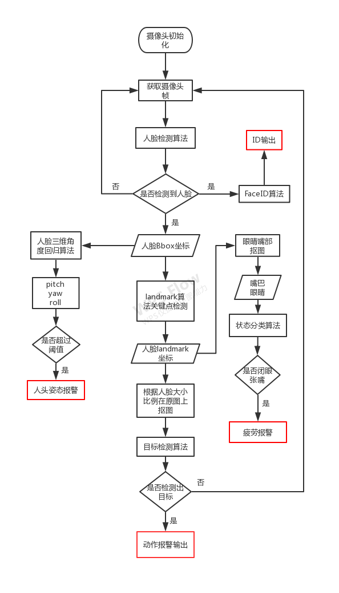

DMS算法技术详解-2

上一篇简单地介绍了一下DMS(驾驶员监控系统)的算法技术细节，这一篇文章再继续深入地写一点。

DMS系统可谓是一个比较复杂的系统了，因为其涉及到的知识面比较广，例如人脸检测，人脸关键点检测，人脸识别，目标检测，动作识别，等等，基本上涵盖了计算机视觉中的常见算法。

群里有同学讨论跟踪算法和目标检测的区别和联系，其实在视频目标检测相关应用中都会有跟踪算法的需求，比如DMS中，其实也可以上跟踪算法。一般跟踪算法相比目标检测算法其资源消耗较少，并且会有ID信息输出，在多目标检测中一般都会上跟踪。跟踪算法后面有机会再聊。

OK，咱们回到DMS算法

---

**系统流程**

下面是一般DMS系统算法流程图，看完这张流程图，看完就会有对系统有个完整的概念

**人脸检测**

人脸检测算法在系统中起着至关重要的作用，因为整个系统中，如果没有人脸，那么所有后续的算法都将没有意义。人脸检测还有一个作用就是可以做“司机不在驾驶位”这个应用判断。

在人脸检测算法实际部署，我在前面的文章中有写过，可以参考下面这个

https://mp.weixin.qq.com/s/vugfNwlH8a7uOIpmhg2Nig

https://mp.weixin.qq.com/s/B0_FbIYdUIUaz_nBp9W3sw

https://mp.weixin.qq.com/s/GQCe7Dkn61LqvtrOUjUiqA

mtcnn应该是耳熟能详的一个经典算法了，虽然目前不算最牛逼的，但是其思想非常值得学习。目前嵌入式端比较实用的算法，像 [BlazeFace](https://github.com/tkat0/PyTorch_BlazeFace)，[CenterFace](https://github.com/Star-Clouds/CenterFace)，[RetinaFace](https://github.com/deepinsight/insightface/tree/master/RetinaFace)貌似都不错。或者像我这样，自己撸一个人脸检测器，时间消耗自己改，改到自己爽为止，我现在觉得resnet10-ssd做人脸检测挺好，精度也还够用。如果有想法的同学，可以加我微信交流。

**关键点检测**

关键点检测算法目前来讲，如果想要做的好，最缺的其实是数据。虽说目前开源数据比较多，但是DMS系统中一般使用的红外图像，开源的RGB图像数据集其实具有局限性。如果有足够的数据一切都好说。

目前关键点检测，比较适合部署的几个思路。

1、类似于MTCNN算法中的LNet那样(可能很多人不知道mtcnn的第四阶段LNet)自己加数据训练；

2、利用[wing-Loss](https://github.com/610265158/face_landmark)自己撸一个主干网络，然后加数据训练

3、直接使用[SeetaFace2](https://github.com/seetafaceengine/SeetaFace2)中的landmark，效果还真不错;

4、使用[PFLD](https://github.com/guoqiangqi/PFLD)算法

PFLD算法肯定是最先进的，推荐研究一波

**人脸三维角度回归**

自己撸一个网络，最后一层设计为全连接层，输出维度为3

直接使用公开数据集，预处理一下训练样本，只留下3维角度监督信息

简单的5层CNN即可拟合出不错效果。比landmark计算的坐标然后再PnP算法拟合角度，要靠谱一些。