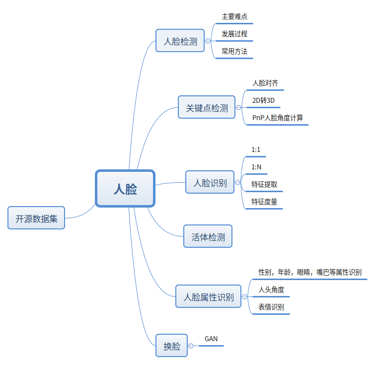
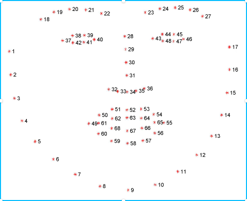
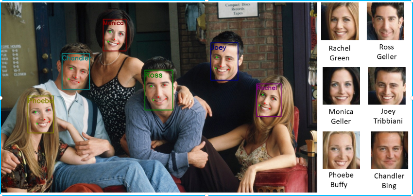
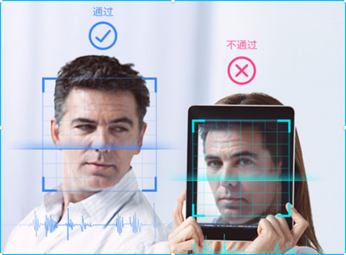

### 人脸技术应用总结--开篇

随着AI技术在人脸应用领域应用的越来越多，人脸的相关技术发展地也是如火如荼，人脸应用领域早已是厮杀一片的红海。在人脸相关领域工作差不多三年了，趁着2019年年底总结一下

人脸有着非常大的应用面，不管是安防，辅助驾驶，还是现在已经全面铺开的人脸支付，都无时无刻用着人脸技术。总之，人脸应用在人机交互中扮演着极其重要的角色

**本片文章是人脸技术系列第一篇，主要简要介绍一下人脸的细分领域应用和综合概述**

---

整个人脸系列的文章会按照上图中所列举出来的内容逐一总结

我认为入门图像算法或者深度学习，直接从人脸着手会是一个非常不错的想法，因为人脸的应用面相对广，入门门槛相对低，自己动手很容易就可以写出一个应用，对于小白入门有着很好的积极促进作用。

整个人脸系列，准备分7个部分来总结

**1、人脸检测  Face Detection**

人脸检测是所有人脸应用的根基，如果没有人脸图像，后面的工作也就无从做起。人脸检测的目的就是在一张图片中定位出人脸，得到人脸位置信息，如下图：

**2、关键点检测  Face Landmark Detection**

关键点检测的目的是检测出人脸图像中的轮廓和五官的位置信息,更精细化地定位。很多应用都非常依赖于五官位置，例如闭眼检测，张嘴检测，美颜应用等等

**3、人脸识别   Face Recognizition**

人脸识别分为1比1和1比N两种，1比1的人脸识别也叫作face verification，1比N的人脸识别叫做face identification。1比1的识别常常用在认证比对这种应用场景，例如火车站进站，人脸识别机器判断人证是否一致，1比N的识别常常用在身份认证，需要在存在N个ID的数据库中检索出是否有一个满足对比条件的ID，例如人脸识别考勤等。

**4、活体检测   Face Anti-spoofing**

如果人脸识别系统要具有一定鲁棒性，那就少不了活体检测，活体检测可以防止照片攻击，面具攻击等欺骗识别系统的行为。

**5、人脸属性识别     Face Attribute Estimation**

人脸属性一般包括年龄，性别，面部朝向角度，是否戴眼镜，是否张嘴等，人脸属性识别已经在很多领域有了应用，例如交通部刚出的新规，商用汽车长要安装驾驶员监控系统，监控司机是否疲劳驾驶。这样就需要判断闭眼张嘴等状态。

**6、换脸  Face Swap**

换脸应用一般应用在娱乐性比较强的行业中，最近一段时间比较火的APP--- ZAO，这个就是换脸的典型应用，可以一键生成于自己的爱豆同框的视频。此技术是一把双刃剑，如果用得好可以造福于民，如果用不好可能就是.....比如下面这张鬼畜.jpg 新桓结衣和郭德纲，哈哈哈

**7、开源数据集训练  Open Dataset**

山世光曾经说过“Data is King”，在弱人工智能的时代，数据为王，谁有数据谁才能占据这个时代人工智能的最高点。后面会总结一下利用开源数据集训练自己的人脸模型，包括人脸检测、关键点检测、人脸属性识别模型。

