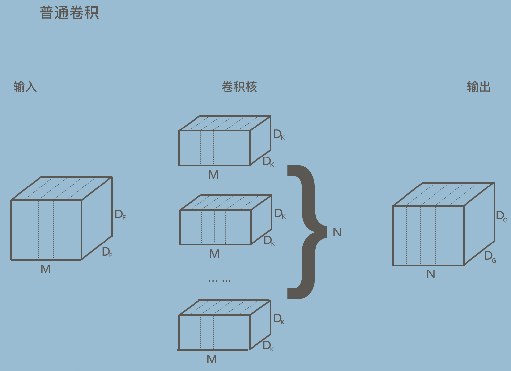
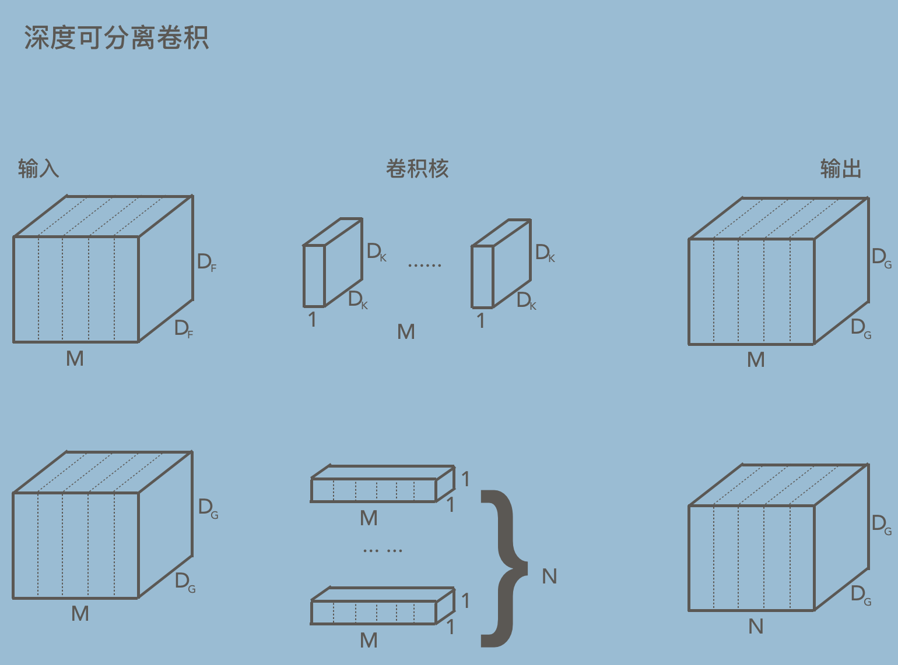
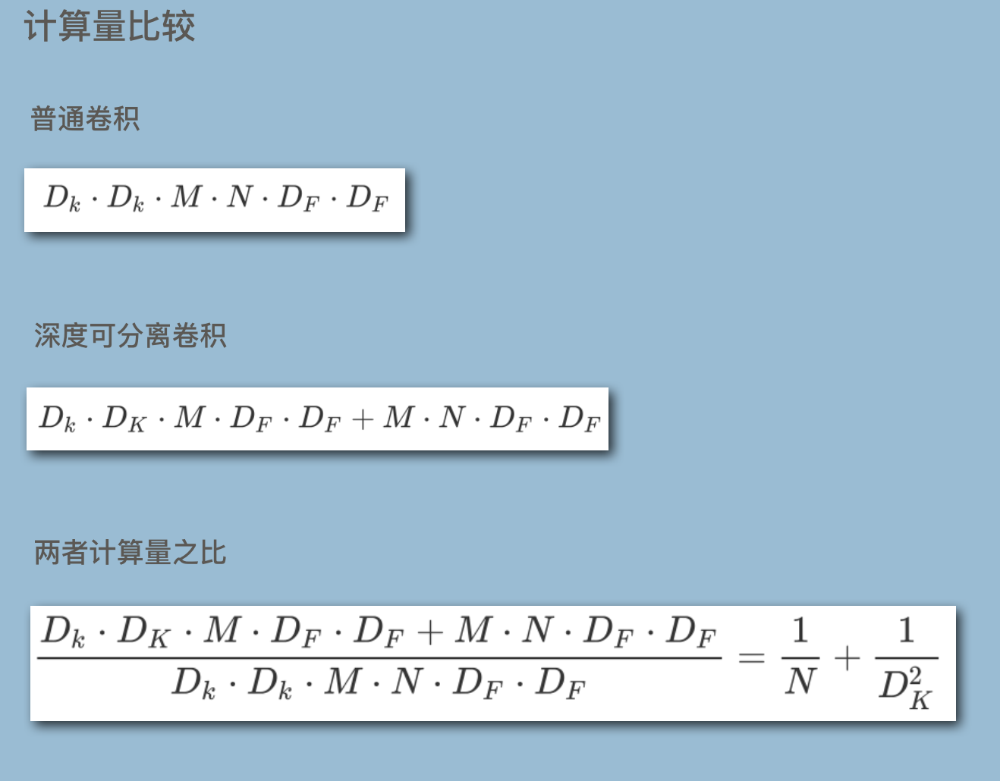

深度可分离卷积性能研究

对比普通卷积和深度可分离卷积FLOPs，在不同硬件平台下对比计算强度

---

**深度可分离卷积**（简写 DepSep Conv）已经被证明了可以作为传统卷积的有效代替方案，并且已经成熟地应用在了很多模型中，例如非常有实际工程意义的两个网络[MobileNet](https://arxiv.org/abs/1704.04861)和[EfficientNet](https://arxiv.org/abs/1905.11946)。

使用深度可分离卷积的网络相比传统卷积网络，具有较少的参数，并且在浮点运算(FLOPs)上也具有非常大的优势。但是由于现在一些计算加速器(GPU,NPU等)的复杂程度很大，导致FLOPs和参数数量等指标和实际性能不符。

在这篇文章中，我们将对比深度可分离卷积和普通卷积之间的区别，然后通过测试研究解释GPU的理论性能和现实性能之间的差异。

### 深度可分离卷积和普通卷积对比

- **普通卷积过程**

- **深度可分离卷积过程**

深度可分离卷积可以看做是两个过程，第一个过程是将深度信息分离，第二个过程是使用1\*1卷积来进行通道融合，还原到目标尺寸

- **两者参数量和计算量比较**

计算量也就是FLOPs，普通卷积的参数量(Parameters)为
$$
D_k·D_k·M·N
$$
深度可分离卷积的参数量为
$$
D_k·D_k·M+M·N
$$
假设卷积核尺寸为Dk=3，输入特征图维度M=128，输出特征图维度N=128，输入特征图尺寸为224，可以分别计算一下两者的参数量和计算量

|            | 普通卷积  | 深度可分离卷积 |
| ---------- | --------- | -------------- |
| Parameters | 147K      | 18K            |
| FLOPs      | 7.4GFLOPs | 0.88GFLOPs     |

**通过计算发现，深度可分离卷积的参数和计算量减少了大约10倍！**

**那么这意味着深度可分离卷积速度会更快吗？**

### 性能测试

下面的测试在Tesla V100 GPU下进行，测试环境为 TensorFlow2.1+CUDA10.1+cuDNN7.6.5

两个测试分别为：

- 单独的卷积层性能测试
- 简单的CNN在CIFAR10数据集上训练测试

实验中分别记录GPU的利用率和吞吐量，例如每秒钟卷积次数或者帧率，英伟达提供了两个GPU利用率的指标，分别是：

- SM utilization 采样周期内，GPU上程序运行时间百分比
- Memory utilization 显存利用率

**单独卷积层测试**

测试单独卷积层性能，设计卷积层参数，卷积核尺寸为Dk=3，输入特征图维度M=128，输出特征图维度N=128，输入特征图尺寸为224。分别使用BatchSize=1和16来测试两组数据，运算精度为fp16。

测试结果如下

|              | Conv            | DepSep Conv     |
| ------------ | --------------- | --------------- |
| batch=1      |                 |                 |
| SM Util.     | 100.0%          | 100.0%          |
| Mem Util.    | 31.0%           | 48.0%           |
| **Conv/sec** | **3585**        | **4241**        |
| **FLOPS**    | **26.5 TFLOPS** | **3.73 TFLOPS** |
| batch = 16   |                 |                 |
| SM Util.     | 100.0%          | 100.0%          |
| Mem Util.    | 35.0%           | 54.0%           |
| **Conv/sec** | **4097**        | **4335**        |
| **FLOPS**    | **30.3 TFLOPS** | **3.81 TFLOPS** |

从上表中可以看到，深度可分离卷积在性能方面(每秒钟卷积次数)表现比传统卷积要好，而且TFLOPs差不多是普通卷积的13%

上面的测试数据是基于Tesla V100 GPU进行的，下面再对比一下不同架构的处理器下的数据

新增对比两个硬件平台，分别是谷歌的[TPUV2](https://colab.research.google.com/)和英特尔CPU--[Xeon E5-2698v4](https://ark.intel.com/content/www/us/en/ark/products/91753/intel-xeon-processor-e5-2698-v4-50m-cache-2-20-ghz.html)

| 平台            | dtype   | conv       | DepSep Conv   |
| --------------- | ------- | ---------- | ------------- |
| **V100**        | float16 | 4097       | 4335 (*1.1×*) |
|                 |         | 30 TFLOPS  | 3.8 TFLOPS    |
| **TPUv2**(单核) | float16 | 1459       | 519 (*0.36×*) |
|                 |         | 11 TFLOPS  | 0.5 TFLOPS    |
| **TPUv2**(多核) | float16 | 2606       | 536 (*0.21×*) |
|                 |         | 19 TFLOPS  | 0.5 TFLOPS    |
| **E5-2698**     | float32 | 85         | 245 (*2.9×*)  |
|                 |         | 0.6 TFLOPS | 0.2 TFLOPS    |

从上表中可以看出，表现最差的是tpu架构的TPUv2，表现最好的是cpu架构的E5-2698。在CPU架构下，单位时间内的运算次数可达到**2.9倍**。

### 训练测试

搭建了一个简单的CNN分类模型，将在CIFAR10数据集上进行训练。模型包含4个卷积层，模型参数精度保存为fp32，训练BatchSize为128

|               | 普通CNN   | DepSep CNN |
| ------------- | --------- | ---------- |
| Parameters    | 529k      | 136k       |
| SM Util.      | 57.5%     | 61.2%      |
| Mem Util.     | 17.9%     | 38.4%      |
| **Image/sec** | **11123** | **9094**   |
| Train Acc     | 81%       | 74%        |

上表可以看出，训练过程中，普通卷积可以实现更大的数据吞吐量，训练的精度也更高。但是这是在v100 GPU平台下的训练过程。所以为了验证其他处理器平台的性能，和上面一样，增加TPU平台和CPU平台实验

| 平台    | Batch Size | 普通CNN | DepSep CNN |
| ------- | ---------- | ------- | ---------- |
| V100    | 128        | 11123   | 9094       |
| TPUv2   | 32         | 2470    | 2693       |
| TPUv2   | 128        | 6418    | 8151       |
| E5-2698 | 32         | 150     | 687        |

表中数据为Images/sec，从数据看来，转换为DepSep CNN之后CPU平台是唯一一个在DepSep CNN下逆势上升的平台，并且其表现是普通CNN的5倍

### 计算强度的表示

单独的参数量或者FLOPs并不能完全表示出计算强度(Arithmetic Intensity)，使用卷积计算量与内存访问量的比值就可以科学地表示出计算强度，因为在计算机体系中，计算肯定是离不开内存访问的。所以简单的理解计算强度，最朴素的方法就是FLOPs除以内存访问量。

|                          | 普通卷积                   | 深度可分离卷积                 |
| ------------------------ | -------------------------- | ------------------------------ |
| Parameters               | Dk\*Dk\*M\*N               | Dk\*Dk\*M+M\*N                 |
| FLOPs                    | Dk\*Dk\*M\*N\*Df\*Df       | Dk\*Dk\*N\*Df\*Df+M\*N\*Df\*Df |
| Input+Output Activations | (M+N)\*Df\*Df              | (M+N)\*Df\*Df                  |
| 内存访问                 | Dk\*Dk\*M\*N+(M+N)\*Df\*Df | Dk\*Dk\*M+M\*N+(M+N)\*Df\*Df   |

计算强度表示为 FLOPS / 内存访问

例如，这里将Dk=3,M=N=3,Df=224带入计算

|                          | 普通卷积   | DepSep Conv |
| ------------------------ | ---------- | ----------- |
| FLOPs                    | 7.4 GFLOPs | 0.88 GFLOPs |
| Memory Access            | 26.0 MB    | 25.7 MB     |
| **Arithmetic Intensity** | **569.5**  | **68.4**    |

这样计算强度就会一目了然！

### 总结

上面的测试数据中，忽略了冗余的计算量，测试方法也是在理想情况下的计算

由于内存带宽和数据IO的限制，深度可分离卷积在GPU上的速度并不快，其主要原因是内存访问量很高

通常在CPU上做卷积计算的过程是调用im2col，也就是把feature map和卷积核在内存上进行重排，排列成可以可以用矩阵相乘的形式，用矩阵乘法来代替卷积。但是1\*1卷积不一样，它是不需要进行内存重排的，这里就比普通卷积节省了时间，然后通用矩阵乘法在CPU上的优化已经非常到位，按道理是核心数越多速度越快

[参考文章](https://tlkh.dev/depsep-convs-perf-investigations/)