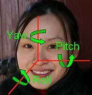
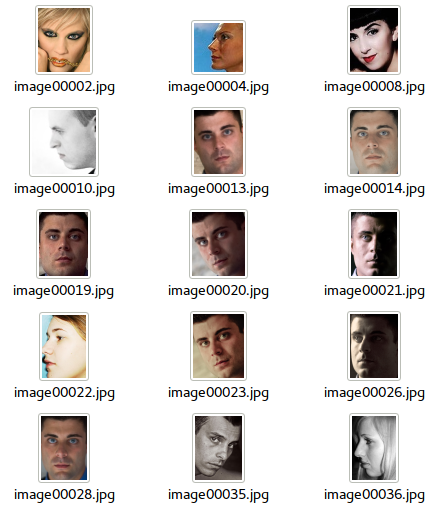
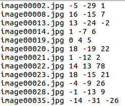
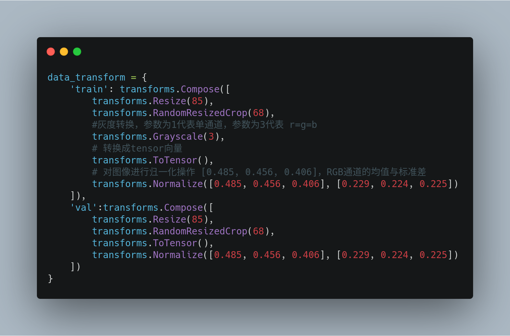

## HeadPose Detector

使用pytorch框架训练一个可以检测人脸三维角度的检测器

总共分为四个部分

- 训练数据
- 网络模型
- 训练
- 部署

### 一、训练样本准备

人脸数据样本来自于[umdfaces](https://www.umdfaces.io/)

经过清洗之后，图像将人脸部分截取出来，然后分别将其对应的标签转换为txt标注，每一张图对应三个lable。

例如：00001jpg pitch yaw roll

训练数据集下载地址：xxx

### 二、pytorch网络搭建

#### 1、数据读取

在读取数据的时候，还需要做数据增强

主要分类两个部分：随机裁剪和灰度变化

将图像缩放到固定尺寸85，然后随机裁剪到68\*68大小

注意，在这里的数据增强过程中不能使用镜像变换或者旋转操作，因为人脸角度变了，其label就变了。

