## EfficientDet文章阅读

[EfficientDet](https://arxiv.org/pdf/1911.09070.pdf)真可谓猛，一骑绝尘！

在比[YoloV3](https://pjreddie.com/media/files/papers/YOLOv3.pdf)少28倍浮点预算量的前提下，精度还可以与之持平！

Google Brain 牛逼！

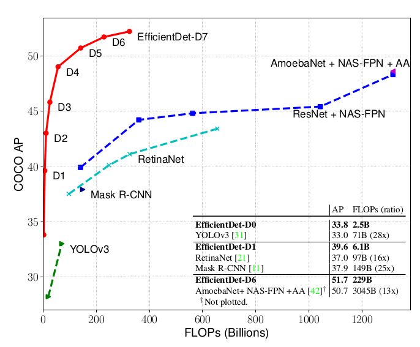

---

### 一、EfficientDet 关键词---Efficient

Efficient这个词对于目前的目标检测领域来说非常关键，为啥这么说？

目前刷榜的SOTA的算法很多，在COCO上数据很漂亮，但是在实际工程部署的时候，时间消耗没法忍受。所以对于目前目标检测算法领域，精度和推理复杂度的Trade off才是目前工程化的关键。

当然，还有同学可能会说，既然大模型的精度可以，那么部署的时候可以使用模型压缩啊。模型压缩确实是工程化部署的一大利器，但是有两个因素要考虑，第一模型压缩，不管是减枝，还是蒸馏还是量化，其精度必然会有损失；第二如果直接做一个比较有效的算法，部署的时候再量化，可玩性会更大。

EfficientDet这篇文章直接给了D0-D7复杂度从小到大的几个模型，可以按需选择。从嵌入式端到服务器端可以全部满足。

### 二、Efficient在哪里

原文章主要突出了3个重点

- **BiFPN**：在[FPN](https://arxiv.org/abs/1612.03144)网络思想上重新进行设计，提出一种可以快速进行多尺度融合的加权双向特征网络(A weighted *bidirectional feature network*)
- **Compound scaling**：提出一种新方法，可以联合改变主干网络，特征网络，box/class网络和分辨率，使得不同计算复杂度满足不同的精度
- **EfficientDet**：一个在有限计算资源下，算法准确性和计算效率很平衡的检测器网络

文章主要也是为了解决两个挑战

- **1、有效的多尺度特征融合**，自从cvpr2017以来，FPN的特征融合方式直接影响了一部分后面的做目标检测的思路，很多优秀的算法都利用了FPN的思路，例如RetinaNet，PANet，NAS-FPN等等。这些网络在做特征融合的时候都没有考虑到待融合的特征是否应该被融合这个点上去，都是重点研究了融合的方式。事实上，并不是所有的特征都需要被融合，并不是所有的特征对提升网络表达能力有正作用。所以这篇文章需要解决一个更好的多尺度融合的策略

- 2、**模型缩放(Model scaling)**，先前的大多数工作都倾向于使骨干网络更大以提高准确性，作者注意到，在兼顾准确性和效率的同时，扩大特征网络和box/class预测网络也至关重要。受到[EfficientNet](https://arxiv.org/abs/1905.11946)思路的启发，提出了一种复合缩放方法，通过变量可以直接联合控制主干网络，特征网络，box/class预测网络的分辨率，深度，和宽度。

  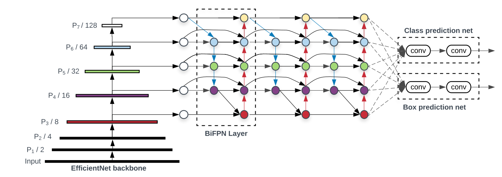

  上图所示的是EfficientDet的架构，分为三个部分，左边是主干网络，也就是同样出自于谷歌大脑的EfficientNet，中间是BiFPN网络，也就是用来将主干网络中不同特征层融合的网络，最右边是将融合之后的特征进行预测box和class的网络最终输出目标检测结果。

### 三、主要内容

#### FPN

在讨论BiFPN之前，先聊聊FPN。它在2017年被首次提出，结构如下图所示

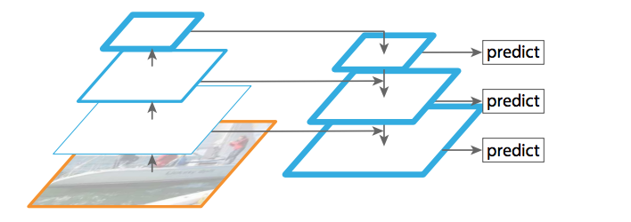

为啥检测算法需要将不同的特征层进行融合呢？

我在之前的文章中说过，目标检测需要解决的量大根本性问题，一个是小目标，另一个是大尺度变化目标。同一个物体在不同场景中其外形尺度肯定会不一样，所以为了解决多尺度问题，就需要网络意识到目标具有多尺度性质。早期的目标检测算法解决多尺度问题都是做图像金字塔，在输出网络之前就将输入图片进行了多尺度变化，使得输入图片中的待检测目标具有多尺度，然后输出再融合结果输出。尽管这种方法效果还不错，但是它实在是太耗时了，不能忍受。

图像金字塔是在早期经典图像处理中被广泛应用的算法，但是现在都2020年了，能用CNN解决的，都一把梭！CNN在除了能表征高层语义之外，还天生对图像尺寸比例变化鲁棒，因此在固定尺度输入的网络中可以提取出不同尺度特征。

从CNN的原理中很容易发现，浅层特征图在原图上的感受野小，适合检出小目标；深层特征图在原图上的感受野大，适合检出大目标。高分辨率特征图具有较低的语义特征，而低分辨率特征图具有较高的语义特征，为了在不同比例下进行可靠的检测，所以融合不同层次的语义信息是一个非常不错的想法。

FPN使用新的连接方式，将深层特征图进行上采样，再将低层特征图进行下采样，然后使用1\*1卷积将他们进行组合，最后求和。对此感兴趣的同学可以去看原论文。

#### BiFPN

下图所示的是FPN，PANET，NASFPN和BiFPN的示意图

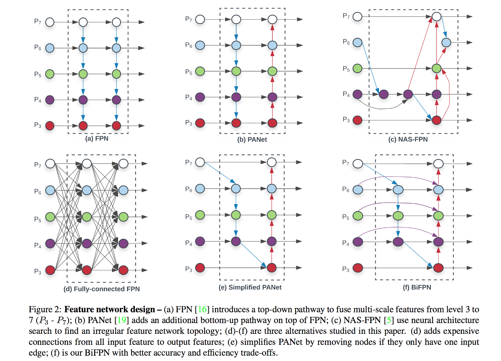

常规的FPN以自顶向下的方式融合多尺度特征，如a所示

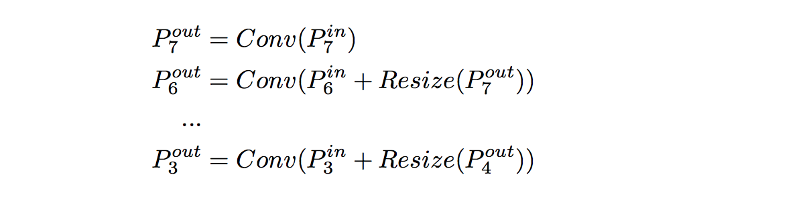

传统的FPN的问题在于它受到单向的信息流的限制，信息流只能自上而下，一定程度上限制了特征的融合。为了解决此问题，PANet添加了额外的自底向上的路径，帮助特征融合，如b所示。当然还有很多其它的文章提出新的连接方式，总之，他们的目的都是融合特征以获取更好的语义信息。

NAS-FPN是花费1000TPU训练时，自动搜索出来的最优网络架构，如上图c所示，这个连接结构很不规则，由于是学习自动搜索得到的，所以它也具有不可解释性，也就是说我们不知道为啥这样连接就具有非常好的效果。

后来实验表明，在在FPN架构上修改连接状态在一定程度上是有意义的，但是特征融合并不仅仅是依赖于不同的连接结构，为了优化出更好的特征融合策略，作者提出以下几个设想：

- 如果一个节点只有一个输入边并且没有特征融合，那么这个节点对整体的特征融合的贡献就非常小，那么可以直接删除它，如图e这样。
- 如果原始输入与输出节点处于同一level，在它们之间添加一条额外的连接，可以在不增加成本的情况下融合更多信息，如图f所示
- BiFPN和其他的FPN类的网络不同，它将每一个双向的路径都视为一个单独的特征网络层，然后重复这一层多次以获取更高层次的特征融合

如果简单地使用不同的连接方式融合特征就能取得最好的效果，**那么NAS-FPN为什么不是最好的网络？**所以必须还得有其他的手段。

#### Weighted Feature Fusion

如果特征图的分辨率不同，那么这些特征对特征融合的贡献是不一样的。所以，需要一些加权的策略来为不同的特征图分配不同的权重。那么如何给这些特征分配权重比例呢？联想到FPN的结构都可以用NAS来自动搜索，那么权重的分配自然也可以用学习来确定权重分配咯，控制权重分配的参数很少，所以学习成本也比NAS搜索结构要低得多。作者尝试了三种公式化的权重分配表示方式

- **Unbounded Fusion**

  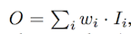

  这里的Wi是科学系的权重，可以是标量(对应特征)，可以是向量(对应特征图通道)，也可以是张量(对应特征图的像素)，作者发现这样的表示方法，可以以最小的训练成本达到很不错的效果，但是由于Wi没有被限制在固定范围，所以训练的时候参数更新很容易跑飞，导致训练及其不稳定

- **Softmax-based Fusion**

  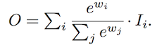

  收到上面那个公式的启发，作者使用softmax函数将Wi的值限制在0-1之间，转化为概率分布，使用概率代表每一个权重的重要性。实验结果非常不错，但是softmax的计算量确实很大，训练过程时间消耗很大，也一定程度上增加了网络延迟

- **Fast Normlized Fusion**

  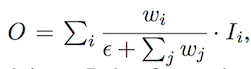

  做了很多实验，克服种种困难，终于使用这种数学方法来表示不同权重学习的分配规则。这种方法简单地将值进行归一化，使得上限为1，合理的控制了参数的上线，这里的参数被设置的很小，0.0001。与基于softmax的方法相比，最终结果虽然稍微差一点点，但是计算简单了太多。

### 四、EfficientDet

#### Architecture

从结构上来说，EfficientDet由三部分组成，主干网络、特征融合网络、box/class预测网络

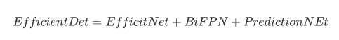

EfficientDet是一个One Stage的检测器，非常类似于SSD和RetinaNet，主干网络是在ImageNet上预训练的EfficientNet，所以训练目标检测的时候可以直接使用EfficientNet的网络参数来进行微调

特征融合部分使用BiFPN网络，它使用来自于EfficientNet的特征，分别从P3-P7引出进行融合

融合之后的特征被送到Box/Class预测的网络，最后的prediction的网络权重在特征的所有层之间共享

#### Compound Scaling

EfficientNet中已经详细介绍了联合缩放维度可以提供更好的特征提取性能，所以在这个算法中也同样使用EfficientNet的操作。之前的一些目标检测算法工作中都是仅仅对主干网络进行缩放或者缩放FPN，这样只关注到一个维度，所以其作用是非常有限的。作者提出一种新的复合缩放方法，使用一个简单的系数ϕ，共同放大主干网络，BiFPN网络，Prediction网络和分辨率的所有维度

- **主干网络**：和EfficientNet的缩放保持一致，以便使用ImageNet预训练的系数

- **BiFPN网络**：在EfficientNets中以指数方式增加了BiFPN宽度（channels），但是由于深度需要四舍五入为整数，所以采用线性增加深度（layers）

  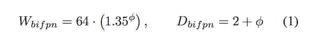

- **Box/Class预测网络**：宽度与BiFPN保持相同，但是网络深度(layers)线性增加

  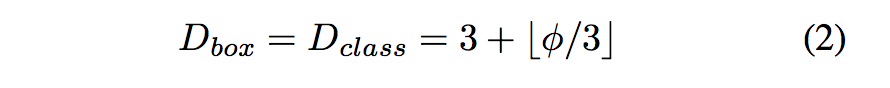

- **输入图片尺寸**：由于在BiFPN中使用了特征层3–7，因此输入分辨率必须可被2⁷= 128整除，因此可以使用以下公式线性地提高分辨率

  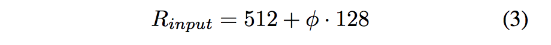

现在，根据上面三个公式和不同的ϕ的值，可以很方便地将网络从Efficient-D0（ϕ = 0）变为Efficient-D6（ϕ = 6），如果ϕ大于等于7，网络消耗的内存将非常大，所以作者将ϕ=7的情况设计为只改变输入图像的尺寸

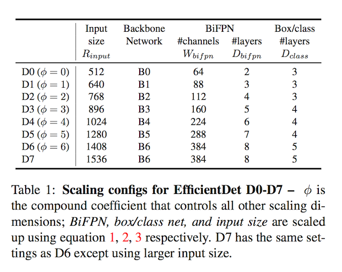

### 五、最后

作者在原文中的Experiments部分写了关于训练时候的一些技巧，里面有关于如何设置训练超参数的一些介绍，这里就不再赘述。

看完EfficientDet的这篇文章，神清气爽！不愧是谷歌大脑的大作！

但是我还是有几个问题：

上面的公式1,2,3是究竟怎么得到的呢？作者在文章中说是采用启发式(heuristics)的方式得到的这组公式，但是我这种普通人估计是得不到启发了。。。

这几年，一直在玩resnet+SSD的架构，魔改主干网络和SSD，以适应不同算力的硬件平台。现在EfficientNet横空出世，看样子可以直接狙击Resnet了，EfficientNet一定是一个像Resnet一样跨时代的网络模型，立帖为证！

昨天训练了一把[pytorch版的EfficientDet](https://github.com/zylo117/Yet-Another-EfficientDet-Pytorch)，发现训练过程很是曲折，比SSD的训练确实要困难很多。

持续跟进，继续学习！

