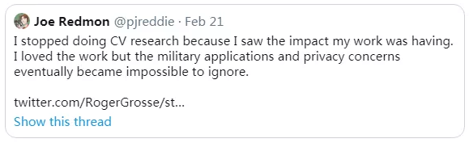
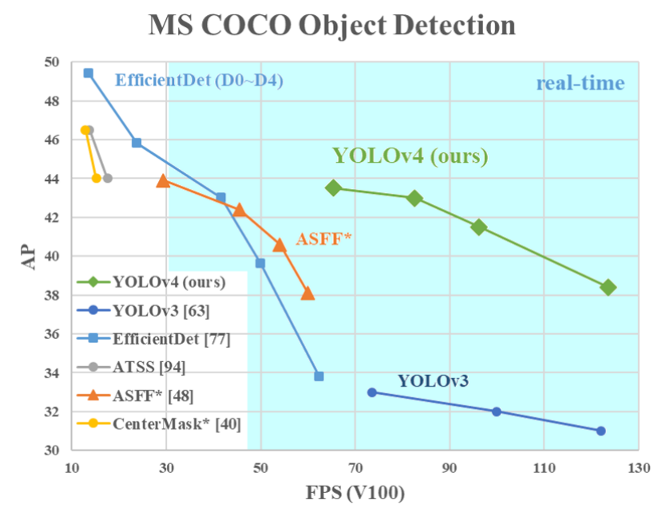
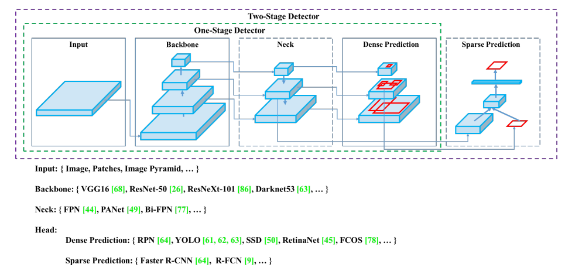
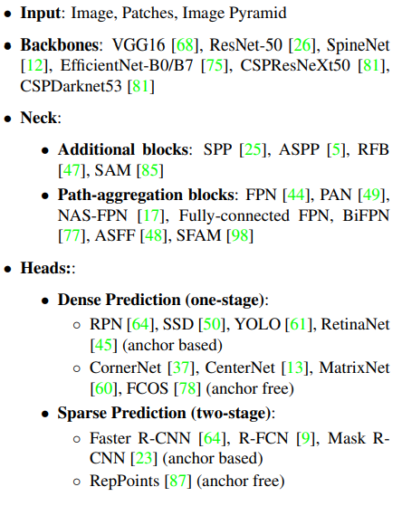
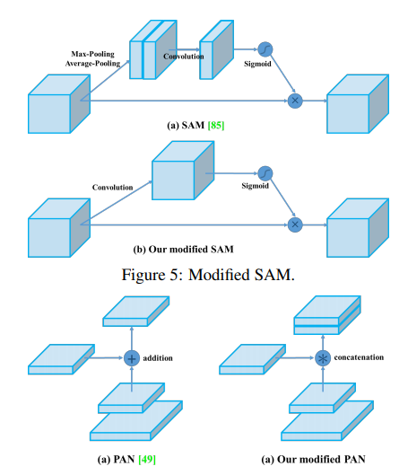
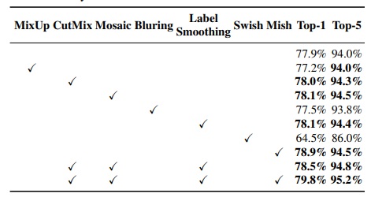
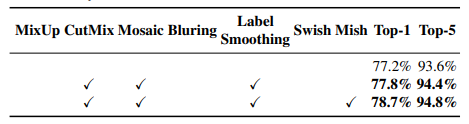
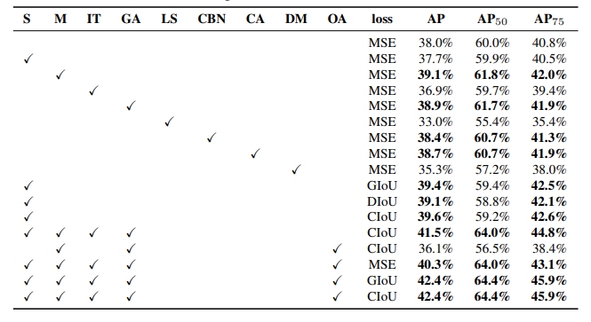
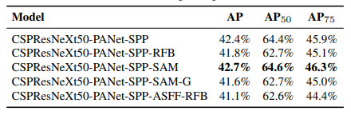

YOLOV4

*作者 ：Alexey Bochkovskiy，Chien-Yao Wang，Hong-Yuan Mark Liao*

在作者署名的地方已经找不到J.R大神的名字了，但是这个YOLOV4应该还是有YOLO的纯正血统的，因为Alexey就是前几代yolo代码在github上的维护者。

论文链接：https://arxiv.org/pdf/2004.10934.pdf

代码链接：https://github.com/AlexeyAB/darknet

---

### **一、前言**

YOLOV4是一个速度和性能更加均衡的检测算法！

先看图

曾经在EfficientDet的文章中，EfficientDet说自己和yolov3相比，D0在速度和yolov3差不多的时候，精度要略胜一筹。现在yolov4和EfficientDet的D2网络相比，精度相当，但是速度要快出D2的两倍。V4相比V3，精度提升了10%，速度提升12%

从文章数据来看，V4并不追求刷榜数据，其主要目的是设计一个能在实际工程中的应用的，且更快的目标检测器，通过优化并行计算而不是降低理论计算量(BFLOP)，不管理论计算量有多小，跑的快才是真的好！

作者说这个算法还有一个目的就是更加简单的训练和部署，对于每一个CV人来说，只要有一块GPU卡就可以训练出更快更强的算法模型。

**看到这里，眼泪都要出来了，因为我目前正在训练EfficientDet，训练过程实在是艰辛**

### **二、文章内容粗读**

**划重点**

1、只要有一块1080Ti或者2080Ti，你就可以拥有一个牛逼模型

2、验证了一些常见和不常见的训练trick对模型性能的影响

3、对目前SOTA的方法进行了修改，使它们更适合单卡训练，CBN，PAN，SAM

文章认为，目前目标检测模型可以被分为4个部分：Input、Backbone、Neck、Head。这里和EfficientDet的文章中是一致的，只不过他们表达的名词不一样，EfficientDet中的第三个部分被称之为Feature Fusion，也就是BiFPN，在本文中统称为Neck。

**架构**

找到一个在网络输入分辨率，卷积层数量，参数数量，特征图尺寸，这四者之间的一个平衡点，从而使精度和速度更加的平衡

经过一系列的实验之后，最终采用的是CSPDarknet53作为backbone，加上SPP模块，然后特征融合使用是PANet，最后的anchor处理方式仍然沿用YOLOV3的，所以这一系列的融合之后就称为了牛逼的YOLOV4

**YOLOv4 = CSPDarknet53+SPP+PAN+YOLOv3**

奥卡姆剃刀原理：如无必要，勿增实体！精辟

网络结构，我用nerton导出来了，贴在了文章最下面

**训练trick**

1、新的数据增强：Mosaic、 Self-Adversarial Training 、class lable smothing

2、遗传算法选择超参数

3、减少训练难度，修改了SAM，PAN，CmBN

**实验**

粗看文章，感觉所有的东西都是现成的，只是用了排列组合的方法将现有的东西拼凑了一下，然后效果就SOTA了。但是看到后面Experiments部分才知道，SOTA并不是那么随便拼凑就可以达到的。

*这里我有一个想法，既然把现有的东西进行组合可以达到SOTA的效果，如果使用NAS来搜索，会不会有新的SOTA，哈哈。*

作者针对每一种小trick都做了一组实验，分别验证了某一项小改动对性能的影响，然后再尝试将其组合。说实话，这个工作量还是有点大。

**总结**

有一些文章很鸡贼，他们经常说自己的算法在性能和算力上trade-off，在文章中用来表示推理耗时的指标经常是BFLOPs，甚至是Params。BFLOPs虽然会直接影响到推理时间，但是这个指标低并一定推理耗时就很低；同理Params更不能代表推理时间了。

在V4这个文章中，作者直接简单粗暴地实验。是骡子是马拉出来溜溜！

直接给出了在不同架构GPU上的实验数据，Maxwell架构和Pascal架构确实就有区别。

我之前写过一点，评价推理时间的指标应该是**计算强度(Arithmetic Intensity)**，如果运算量低，但是和内存IO量很大，这样的推理依然是耗时的。

### **三、跑一跑**

在github上down下代码

使用netron看一下网络结构

这里贴一个网友发出来的视频

