## YOLOV4

yolov4在Tesla V100硬件和coco数据集下达到43.5%AP/65FPS的成绩

v4这篇文章更像是很多种trick的一种集成，实验做着做着就变成了SOTA了。在研究v4的文章过程中，最有趣的就是可以看到一个小trick如何被验证有效，然后被修改，最后被集成到算法中。

### **1、BackBone**

为了提升精度，主干网络经常被设计的很深，一方面增强模型的表达力，另一方面增大了感受野，然后随着网络变深，训练难度也会随之增大，所以会在网络中加入一些 skip-connection。YOLOV4的主干网络采用的是CSPDarknet53，这里来简单梳理一下这个bakebone

#### Dense Block

自从resnet将残差概念带入到CNN之后，稠密连接已经被证实对于提升网络表达能力有效果，可以参考 [Densely Connected Convolutional Networks](https://arxiv.org/pdf/1608.06993.pdf)。

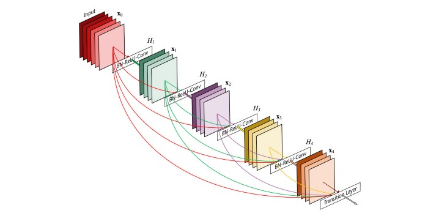

一个Dense Block可以包含多个卷积层，如上图所示的Hi。每一个卷积层(Hi)中包括卷积层，BN层，ReLU等。除了输入层以外，其他的所有Block的输入都来自于前面所有的Block，所以这样特征图的数量就会变大，这个概念就被称为增长率(growth rate)。

在多个Dense Block之间加上卷积和池化之后，就可以组成Dense Net

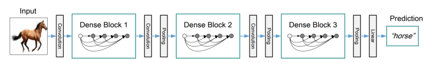

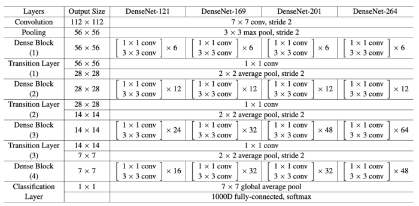

#### **CSP(Cross-Stage-Partial-connections)**

[CSPNet](https://arxiv.org/pdf/1911.11929.pdf)将DenseBlock的输入特征图分成了两个部分，如下图所示

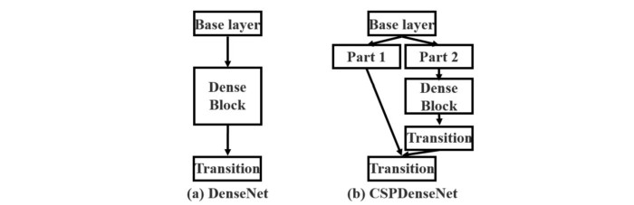

CSP在Dense Block上的改进，只允许Part2经过Dense Block的主要目的是降低计算量。具体的理论原理参考原文

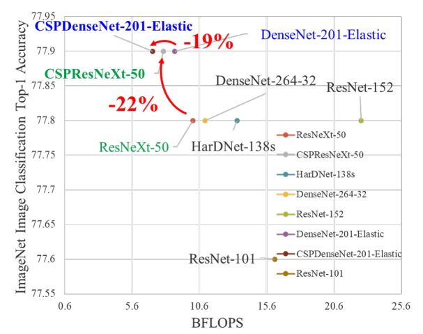

#### **CSPDarknet53**

这个才是这里的主角，YOLOv4将CSP方法应用到了DarkNet53中，如下图所示

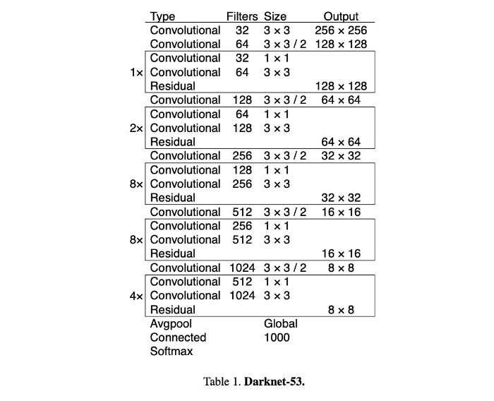

Darknet53来自于[YOLOv3](https://arxiv.org/pdf/1804.02767.pdf)，v4文章中说，CSPDarknet53虽然在做classification任务的时候精度不如ResNet系列网络，但是在目标检测任务中会略胜一筹。然后如果在CSPDarknet53上加上一点其他的trick，classification能力也可以超过ResNet。这里后面再说。

### **2、Neck**

在上篇文章中就介绍过Neck这个概念，整个网络架构就是 Input,Backbone,Neck,Prediction。Neck主要是做多尺度特征融合。

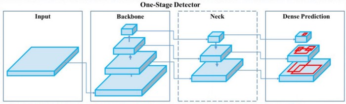

信息流在喂给Prediction之前，会在Neck阶段进行element-wise或者concat融合，bottom-up信息流(下采样)包含更多的空间信息，top-down信息流(上采样)会包含更多的语义信息。

#### **FPN(Feature Pyramid Network)**

早在YOLOV3中，就已经使用了和[FPN](https://arxiv.org/pdf/1612.03144.pdf)类似的在多尺度上进行目标检测的方法

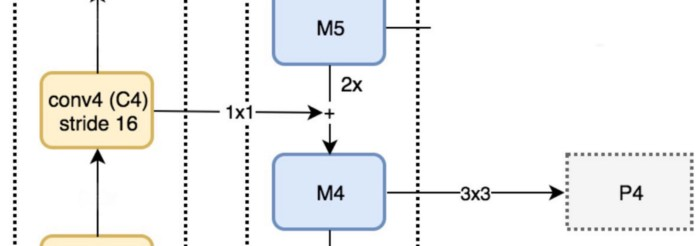

如上图所示，M5经过2倍上采样之后和特征图与C4输出经过1\*1卷积之后的特征图进行融合得到M4，M4再经过3\*3卷积用来降低上采样带来的伪像(artifacts)，最后输出P4

#### **SPP(spatial pyramid pooling layers)**

在[SPP](https://arxiv.org/pdf/1406.4729.pdf)网络中，最后面的一个池化层被空间金字塔池化(spatial pyramid pooling layer)所代替，特征图在空间上被分为m\*m个维度，m分别是1,2,4，然后分别在每一个维度上做最大值池化(max pool)，这样最后输出的特征表示就是定长的，然后将定长特征输入给FC层。

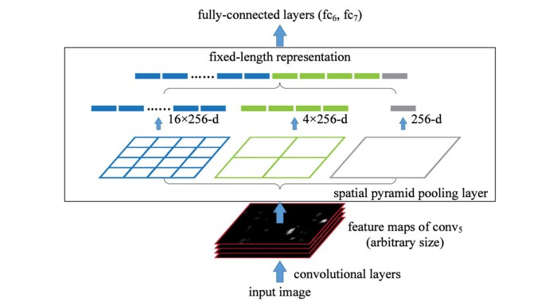

传统的CNN模型由于最后有FC层，所以网络输入只能是固定尺寸，但是SPP因为有空间金字塔池化，所以不受这个限制。当然，类似于FCN这样的不包含FC层的网络也是可以任意尺寸输入的，这种设计对于空间信息的提取非常有用，所以FCN一般用于分割领域。

对于YOLO来说，将2D特征图转换为定长的1D向量，这种操作不一定是最优的。

#### **YOLO with SPP**

分别使用1\*1,5\*5,9\*9,13\*13的最大值池化对输入特征图进行处理，然后将来自不同尺寸的特征图进行concat操作，SPP如何被加到YOLO中，可以参考下图。下图来自于文章《[DC-SPP-YOLO](https://arxiv.org/pdf/1903.08589.pdf): Dense Connection and Spatial Pyramid Pooling Based YOLO for Object Detection》

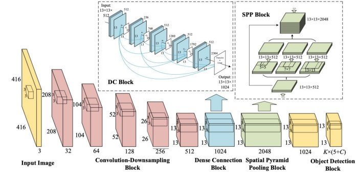

#### **PAN(Path Aggregation Network)**

在传统的串联的CNN模型设计中，浅层网络主要负责提取局部的纹理和图案信息输入给深层网络，从而提取去全局的语义信息。随着网络的加深，局部信息就很可能被丢失。

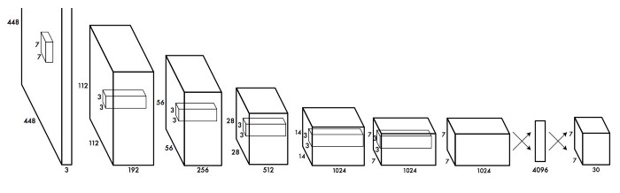

后来随着深度学习的发展，层与层之间的连接变得复杂，例如DenseNet，每一层都直接与之前的所有层直接相连

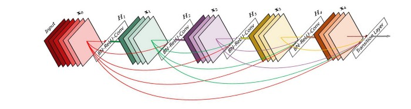

例如，FPN，重新设计相邻层的信息流交互

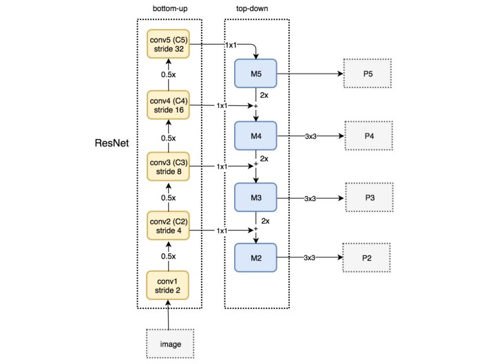

所以随着深度学习的发展，网络结构中层与层之间的信息交互就变成了一个模型设计的关键

如下图所示是[PAN](https://arxiv.org/pdf/1803.01534.pdf)网络目标校测框架图

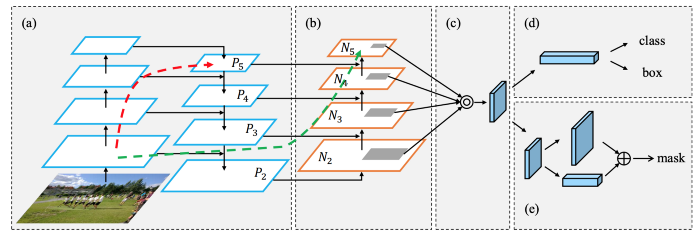

在b部分，增加了自底向上的路径，浅层的局部信息可以容易地传到深层，红色箭头表示FPN的路径，绿色箭头表示PAN路径

FPN做目标检测的时候，分别是在每一个尺度上进行独立地检测，这样会导致两个问题，第一个是没有利用来自其它层的信息，第二是预测出来的信息会有重复冗余。

PAN使用element-wise max融合了所有层的信息。

#### **SAM(Spatial Attention Module)**

注意力机制在模型设计中用的也挺多的。在[SAM](https://arxiv.org/pdf/1807.06521.pdf)中，在一个特征图上分别进行最大值池化和均值池化，这样就可以生成两组特征图，两组特征图经过卷积层，再经过非线性层之后就可以产生空间注意力，如下图所示

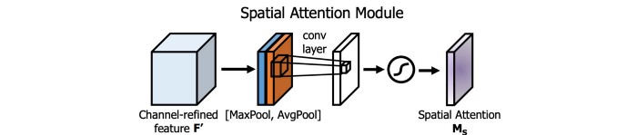

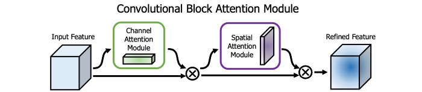

在YOLOv4中，修改了SAM，直接使用卷积代替最大值池化和平均池化，进行注意力操作

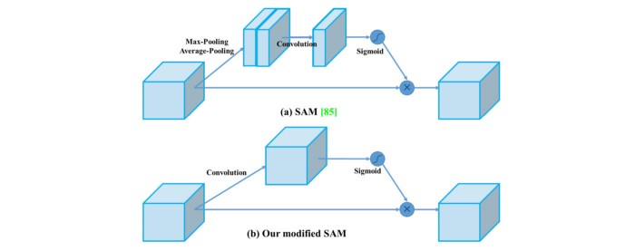

### **3、主干网络中的 Bag of Freebies(BoF)** 

目标检测算法在训练过程中提升性能，常见的无非就是几种套路，数据增强，处理类别平衡，损失函数，软标签等。这些操作只在训练阶段完成，不会对模型的推理速度产生影响，所以v4的作者称之为“Bag of freebies”。

YOLOv4中包含的一些BoF操作有：

- 数据增强，CutMix和Mosaic
- 正则化，Dropblock
- Class label smoothing

#### **CutMix**

如下图所示，CutOut是将图像中随机区域进行裁剪，用黑色填充，这样可以使模型在训练的时候不要对特定的特征过多的拟合；CutMix是将一张图片的一部分裁剪到另外一张图上，标签也会随之进行修改，例如将猫的一部分裁剪到狗的图片上，标签可以被标注为0.6 Dog，0.4 Cat。[CutMix](https://arxiv.org/pdf/1905.04899.pdf)来自于这篇文章《CutMix: Regularization Strategy to Train Strong Classifiers with Localizable Features》，具体方法可以参考原文。

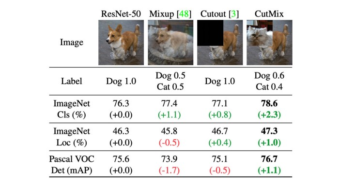

#### **Mosaic**

上面的CutMix只能将两张图片进行融合，这里的Mosaic可以将4个训练图片合并为一个训练图像，这样每一个训练样本都具有更大的多样性，也可以在一定程度上减少对大Batch Size的需求。

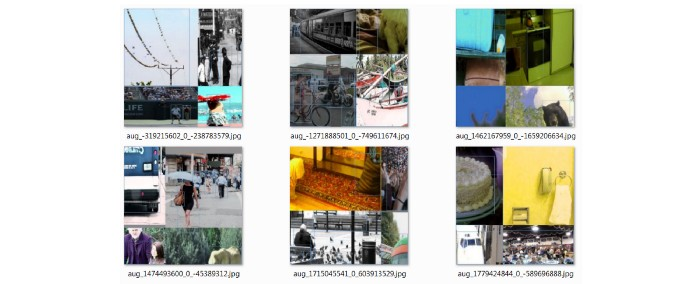

不管是普通训练还是multi-scale training，根据我们的炼丹经验，coco上训练出来的模型，小目标的AP永远是比中目标和大目标低很多，一般都是低了2倍左右。《[Stitcher](https://arxiv.org/pdf/2004.12432.pdf): Feedback-driven Data Provider for Object Detection》这篇文章中的方法貌似有点跟YOLOv4中的mosaic撞车了。在这篇文章中，统计了小目标在数据集中的分布，发现训练集中的小目标数量并不少，如下面表格所示，小目标所占比例41.4%，数量上比其他两种都还要多；但是小目标的分布却是非常不均匀，只有52.3%的训练图片中包含有小目标，而其他两种分布都是相对均匀的。

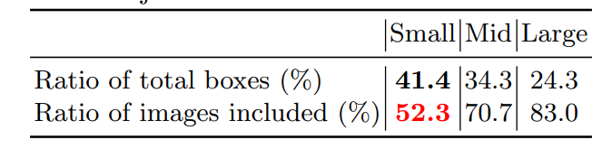

然后作者又统计了训练过程中小目标的loss分布，超过50%的iteration中小目标所产生的loss都非常低，这也就说明了小目标提供的监督信息是不足的。所以顺着这个思路，直接从源头解决问题，想办法解决小目标分布不均匀的问题，也就是这个数据增强的思路。具体细节可以参考stitcher这篇文章。

#### **DropBlock Regularization**

2012年，Hinton提出DropOut，主要是解决网络模型训练过程中过拟合的问题，以一定概率失活一些全连接层的神经元连接，使模型不会太依赖与某些局部特征，提高泛化性。但是这种方法不适用与卷积层，在图像中，相邻位置像素都具有强相关性，如果丢掉一些像素，它的空间信息还是可以被检测到，如下图中间所示。[DropBlock](https://arxiv.org/pdf/1810.12890.pdf)就是在卷积层上实现类似功能的正则化

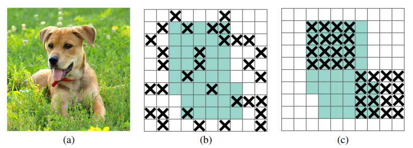

丢掉单独的像素反而不好操作，在文章中实现的直接丢掉block_size\*block_size的块。DropBlock和DropOut一样只在训练过程中使用，下图显示的就是DropBlock的伪代码

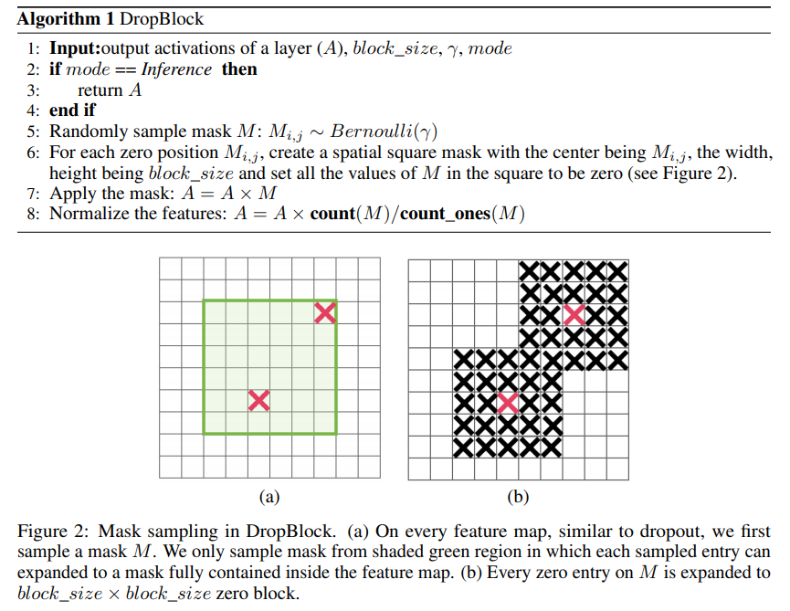

#### **Class Label Smoothing**

在训练深度学习分类模型的时候经常会碰到两个问题，第一个是过拟合(overfitting),第二个是过度自信(overconfidence)。过拟合在上面已经讨论过，通常处理这种问题的套路是提前停止，dropout，正则化等操作；标签平滑(Label Smoothing)就是处理过度自信的一种方法，不过只用于具有softmax的模型训练。在训练过程中，预测值为100%的时候意味着模型是记住了训练样本的数据，而不是从训练数据中学习知识，所以适当的将label平滑之后，有助于分类的学习，提高泛化性。具体可以参考这篇文章 [Label Smoothing](https://towardsdatascience.com/what-is-label-smoothing-108debd7ef06)

### **4、主干网络中的Bag of specials(BoS)**

“Bag of special”就是在提升精度的同时会带来一些推理负担的技巧。常见的有增大感受野、注意力机制、特征融合、NMS等

YOLOv4中包含的BoS技巧有：

- Mish activation
- CSP(Cross-stage partial connections)
- MiWRC(Multi-input weighted residual connections)

#### **Mish activation**

从激活函数的发展历史来看，基本上都是通过实验来确定的，在NAS中也经常看到搜索最适合某个数据集的激活函数，例如谷歌大脑在2017年提出的[Swish](https://arxiv.org/pdf/1710.05941.pdf)也是通过实验证明比ReLU系列的表现要好

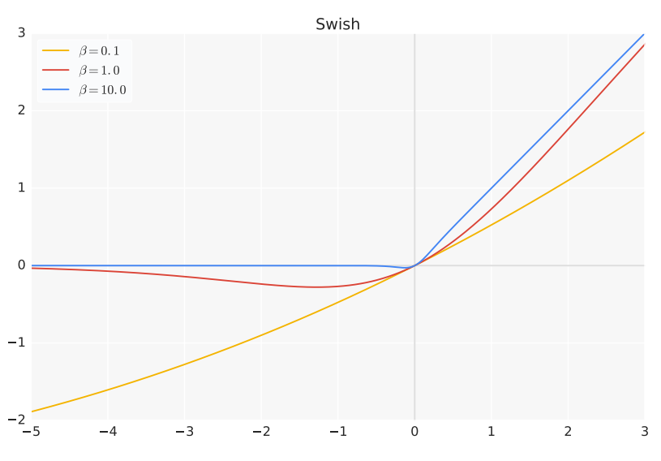

[Mish](https://arxiv.org/pdf/1908.08681.pdf) 是一种比较新的激活函数，跟ReLU和Swish有一点相似，但是效果在大多数数据集上都优于后者，函数图像如下图所示

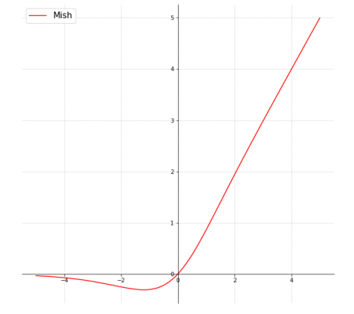

函数表达式如下图

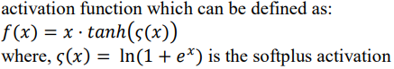

使用Mish之后，YOLOv4的性能提升明显

#### **MiWRC(Multi-input weighted residual connection)**

多输入加权残差连接这个方法来自于[EfficientDet](https://arxiv.org/pdf/1911.09070.pdf)，也就是EfficientDet中说的带权重特征融合(Weighted Feature Fusion)

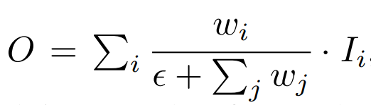

Wi是一个可训练参数，具体原理参考EfficientDet

### **5、检测器中的BoF(Bag of Freebies)**

- CIoU-loss
- CmBN
- Self-Adversarial Training

#### **CIoU-loss**

谈到目标检测，肯定少不了IoU，也就是交并比，在anchor-based的方法中，不仅可以用来确定正负样本，还可以用来评价预测box和标注box的距离，所以Iou-loss应用在目标检测中比较常见。

但是IoU作为损失函数会有一个先天性的不足。两个box的IoU相等的时候，会涵盖很多种情况，如下图所示

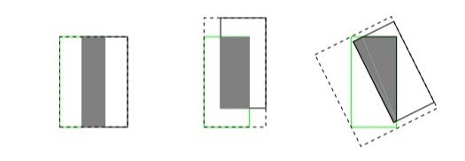

这三种情况下，其IoU是相等的，但是他们分别在训练的时候回归效果肯定是不一样的，左边回归效果最好，右边最差。当然还有一种情况，当两个box没有重合部分的时候，其IoU都是0，其loss就是一样的，这样显然是不科学的。

后来CVPR2019中提出了[GIoU](https://arxiv.org/pdf/1902.09630.pdf)，解决了IoU作为损失函数的痛点，不仅关注重叠区域，还关注其他的非重合区域，再后来[DIoU](https://arxiv.org/pdf/1911.08287.pdf)被提出来，将目标与anchor之间的距离，重叠率以及尺度全都都考虑进去了，解决了GIoU训练过程中不容易收敛的问题，DIoU应用到yoloV3上，直接涨点3个。

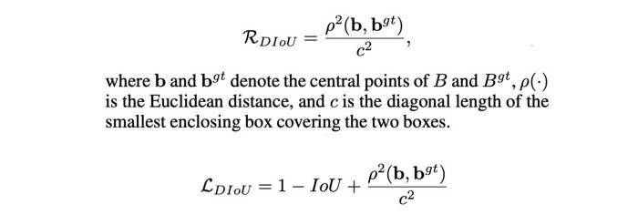

DIoU引入一个新的目标用来降低两个box的中心距离，关于IoULoss可以参考[知乎这个回答]([https://www.zhihu.com/search?type=content&q=iou%20loss](https://www.zhihu.com/search?type=content&q=iou loss))

在yoloV4中使用的loss是CIoU，进一步增加预测box和标注box之间的重叠区域，然后最小化他们之间的中心点距离，保持box的长宽比一致

#### **CmBN**

原始的BN操作是针对每一个batch中的数据进行计算均值和方差，但是当batch size设置的很小的时候，预测值中就会存在很多噪声。在[CBN](https://arxiv.org/pdf/2002.05712.pdf)方法中，通过迭代一定的次数，然后估算出K次迭代中的统计信息

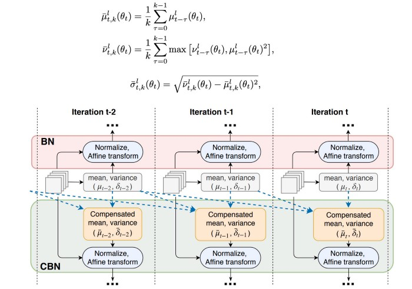

CmBN在CBN基础上稍微修改了一下下，只在单个batch中的小mini-batch之间手机统计信息

#### **SAT(Self-Adversarial Training) **

自监督训练其实也是属于一种数据增强的方法。我们传统意义上进行的模型训练，首先训练数据前向传播，然后计算loss，再将loss反传回来，最后更新网络层权重。但是在自监督训练中，流程就不是这样的了，首先训练数据进行前向传，计算loss，然后网络会将输入训练图片进行修改，使得loss变得更大，也就是针对当前模型进行攻击。然后使用新图像再进行训练，这样可以理解为有针对性的数据增强。

#### **遗传算法选择超参数**

遗传算法是一种比较经典的算法了，其大致原理就是随着迭代次数增多，每一次迭代都会出最好的一批参数，然后人为地使其“基因突变”，也就是修改超参数，然后再继续迭代，最终选出一组最好的参数。

### **6、检测器中的Bag of Specials**

#### **DIou-NMS**

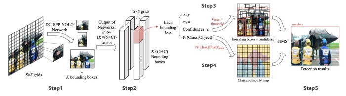

DIoU前面说过，里面包含了两个box之间中心点之间的距离，在最后做NMS的时候，也可以将box之间的中心点距离加入到计算中。实验结果显示对于遮挡情况鲁棒性非常强

#### **7、最后**

YOLOv4中集成了非常非常多的技巧，每一个技巧都是通过自己的实验来确定最终是否能够work的，可见作者在object detection方面积累之深，内功之深厚，对还要有钱！没钱买卡，这些实验做到猴年马月都出不了结果

> 人类的大脑，是想象不出自己没有见过的东西的，而任何所谓的“创新”，都是大脑中已有知识或影像的排列重组

原文

https://medium.com/@jonathan_hui/yolov4-c9901eaa8e61

