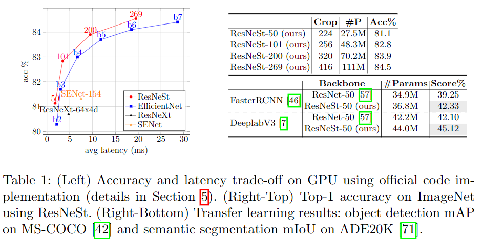
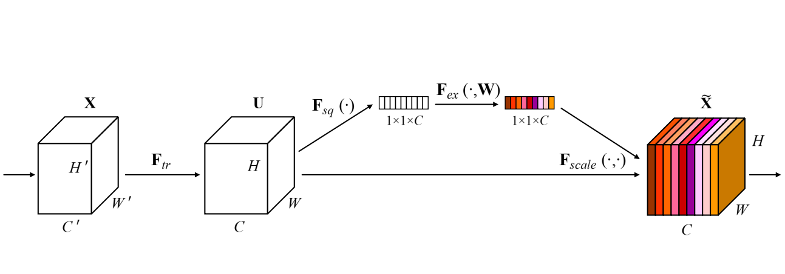
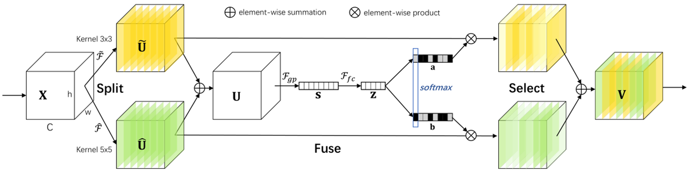
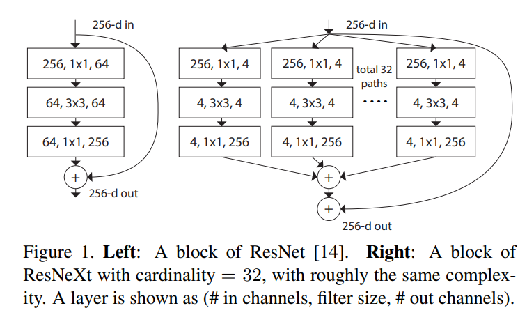

### Resnst-Refinedet

最近李沐团队提出了最强的ResNet改进版，在多项任务达到SOTA

李沐也发朋友圈宣传了这篇文章

经过实际测试，ResNeSt表现确实不错。将RefineDet的原来的resnet50的主干网络替换成ResNeSt50，发现效果提升明显，所以想写点东西和大家分享一下。

该项目已经开源，后续也会继续优化完善，欢迎大家指教。

[项目Repo链接](https://github.com/pengyang1225/resnest-refinedet)

[ResNeSt文章](https://hangzhang.org/files/resnest.pdf)

[Official ResNeSt Github](https://github.com/zhanghang1989/ResNeSt)

#### 一、ResNeSt

先看一下ResNeSt的文章数据，如下图所示

ResNeSt-50 在 ImageNet 上实现了81.13％ top-1 准确率，简单地用ResNeSt-50替换ResNet-50，可以将MS-COCO上的Faster R-CNN的mAP从39.25％提高到42.33％！简单地用ResNeSt-50替换ResNet-50，可以将ADE20K上的DeeplabV3的mIoU从42.1％提高到45.1％！性能显著提升，参数量并没有显著增加。

轻松超越ResNeXt、SENet等前辈（巨人）们。

文中显示的数据也比EfficientDet略胜一筹，ResNeSt的主要Block如下图所示

**主要思想**:

ResNeSt 的全称是：Split-Attention Networks，也就是特别引入了Split-Attention模块。这里，ResNeSt 中的 S就是 Split。这里要说一下，ResNeSt 实际上是站在巨人们上的"集大成者"，特别借鉴了：Multi-path 和 Feature-map Attention思想。

其中：
GoogleNet 采用了Multi-path机制，其中每个网络块均由不同的卷积kernels组成。
ResNeXt在ResNet bottle模块中采用组卷积，将multi-path结构转换为统一操作。 
SE-Net 通过自适应地重新校准通道特征响应来引入通道注意力（channel-attention）机制。 
SK-Net 通过两个网络分支引入特征图注意力（feature-map attention）。
ResnetXt 普通卷积核深度可分离卷积的这种策略：分组卷积，他通过控制分组的数量（基数）来达到两种策略的平衡。分组卷积的思想是源自Inception，不同于Inception的需要人工设计每个分支，ResNeXt的每个分支的拓扑结构是相同的。最后再结合残差网络，得到的便是最终的ResNeXt。

讲到这里可能有人不是很明白什么是SE-Net，什么是SK-Net，什么又是ResnetXt呢？这里我不一一说明了，上图说话，大家看一下就应该明白了。

**SENet**

**精髓**:[SENet](https://arxiv.org/abs/1709.01507)学习了channel之间的相关性，筛选出了哪些channel的feature作用更大，哪些channel的feature作用更小。它稍稍增加了模型的计算量，但是提点明显。

**SKNet**
**精髓**:[SKNet](https://arxiv.org/abs/1903.06586)提出了具有不同尺寸核的SK卷积核用于实现神经元的不同感受野大小。该卷积包含Split,Fuse,Select三个操作，如下图所示。其包含两个分支。因此，本例中只包含两个不同尺寸大小的kernel，可以很容易扩展到多尺寸的卷积核中。

**ResNetXt**
**精髓**:普通卷积核深度可分离卷积的这种策略：分组卷积，他通过控制分组的数量（基数）来达到两种策略的平衡。分组卷积的思想是源自Inception，不同于Inception的需要人工设计每个分支，ResNeXt的每个分支的拓扑结构是相同的。最后再结合残差网络，得到的便是最终的ResNeXt。

#### 二、RefineDet

[RefineDet](https://arxiv.org/pdf/1711.06897.pdf)是张士峰大神在CVPR2018的一篇文章，[RefineDet的官方代码](https://github.com/sfzhang15/RefineDet)和文章一同release的，感兴趣的同学可以去看看官方实现。

上图是RefineDet的检测框架。该框架由两个模块组成，即上面的Anchor Refinement Module（ARM）和下面的Object Detection Module（ODM），它俩是由Transfer Connection Block（TCB）连接。  

在这个框架中，ARM模块专注于二分类任务，为后续ODM模块过滤掉大量简单的负样本；同时进行初级的边框校正，为后续的ODM模块提供更好的边框回归起点。ARM模块模拟的是二步法中第一个步骤，如Faster R-CNN的RPN。  

ODM模块把ARM优化过的anchor作为输入，专注于多分类任务和进一步的边框校正。它模拟的是二步法中的第二个步骤，如Faster R-CNN的Fast R-CNN。    

其中ODM模块没有使用类似逐候选区域RoIPooling的耗时操作，而是直接通过TCB连接，转换ARM的特征，并融合高层的特征，以得到感受野丰富、细节充足、内容抽象的特征，用于进一步的分类和回归。因此RefineDet属于一步法，但是具备了二步法的二阶段分类、二阶段回归、二阶段特征这3个优势。

**流程**
网络总体来说就是把ssd这个one stage模型，通过加入top down的方法变成two stage模型。

1.bottom up阶段（论文称之为ARM，anchor refinement module）为常规ssd多尺度预测阶段，做预测所提取的特征图分别为：conv4_3，conv5_3，fc7，conv6_2。每一个特征图都会有两个子网络分支，为别为预测anchor位置的子网络mbox_loc（3组w, h, x, y，子网络卷积层的channel为12）和预测是否为anchor类别的子网络mbox_conf（3组0,1，子网络卷积层的channel为6），筛选出的负例样本置信度高于0.99的就不会传入到top down阶段（论文称之为obm，object detection module）以此来控制正负样本的比例不均衡问题。

2.将ARM阶段预测出来的结果调整anchor参数(conf:0/1,w,h,x,y图中标记为refined anchors)，将特征图conv4_3，conv5_3，fc7，conv6_2输入给TCB单元（transfer connection block）得到P3, P4, P5, P6传入给obm阶段。TCB单元实质上就是top down结构，作用就是使得多尺度特征图的信道融合以此来丰富特征。最后生成的特征图为：P3, P4, P5, P6（其中P3, P4, P5, P6的生成分别对应ARM中的conv4_3，conv5_3，fc7，conv6_2相对应。有一个细节就是当conv4_3，conv5_3层在做anchor 的预测亦或者是做top down的TCB操作的时候为了防止反向传播的剃度过大导致loss输出nan，这两层会经过一个L2normlization操作然后分别扩大常量倍数，scale的值分别为10和3 .

3.在ODM模块会对TCB传过来的特征图进行反卷积特征融合，解决小目标检测效果欠佳的问题，同时会将ARM模块传过来的候选框作为预选择框。

4.在top down阶段做框精细调整的回归和物体分类任务。每一个特征图都会有两个子网络分支，为别为精细调整anchor位置的子网络mbox_loc（3组w, h, x, y，子网络卷积层的channel为12）和预测是否为物体类别的子网络mbox_conf。

**优点**

1.当时RefineDet提出来的时候，有不少人说，RefineDet不属于一步法，毕竟有两阶段的分类和回归。我们认为，二步法之所以精度比较高，是因为它有一个逐区域操作的第二步，这个操作非常有效果，但也比较耗时，而RefineDet在没有用逐区域操作的情况下，获得了同等的效果。因此我们认为，区分一步法和二步法的关键点：是否有逐区域的操作。

2.同时也加入了FPN算法，解决了SSD网络小目标检测效果不佳的尴尬局面。

**实际经验小结**

**1、对于网络实际开源的一些项目，我们通过简单的魔改，其实效果都不尽如人意。**

之前针对项目的优化，我们通过会在 backbone 基础上进行魔改，比如使用 pyramid representation 来提高感受野大小，或者引入全局的上下文信息，还有比较 expensive 的 Spatial Attention 的工作。与其这样魔改，不如我们把这些改进做到 backbone 里直接预训练一下。其实实际很多项目，我们在基础网络上的小修小补不能很大的提升网络性能。相对于对已有网络进行魔改，可能不如对基础网络提升来的直接。希望这篇论文可以抛砖引玉，以后可以看到更多的关于基础网络研究的文章。毕竟分类问题基本属于已经解决了的问题，能够更好地为下游应用服务，才是更加有意义的。

**2、明明数据很多了，但是效果还是不理想。**

数据并不是越多越好，冗余的数据会降低模型的泛化能力，高质量的数据，数据的多样性对模型性能很重要。

这些都是个人经验，可能有不完善的地方，欢迎大家指正。

