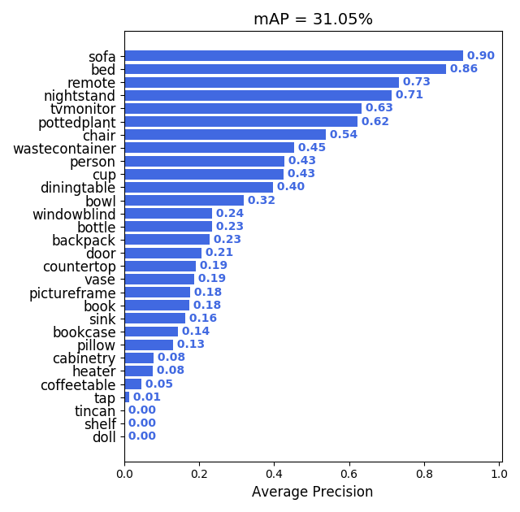
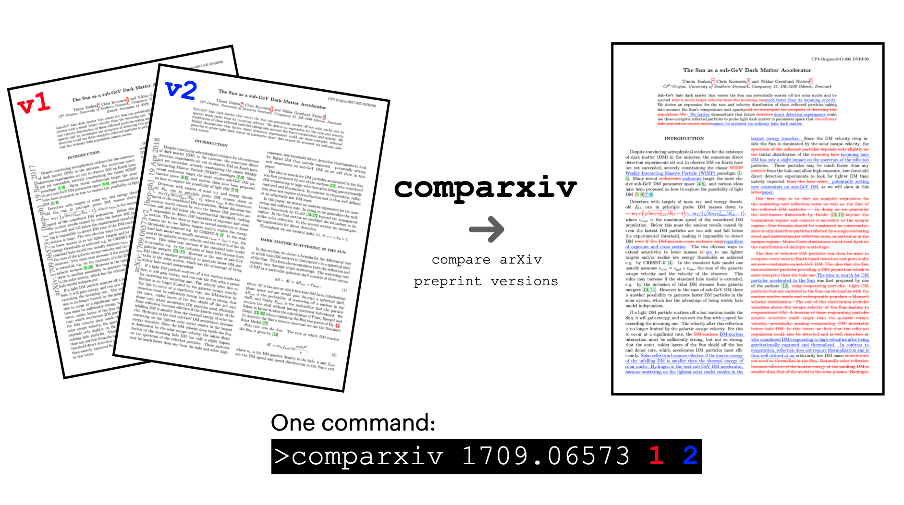
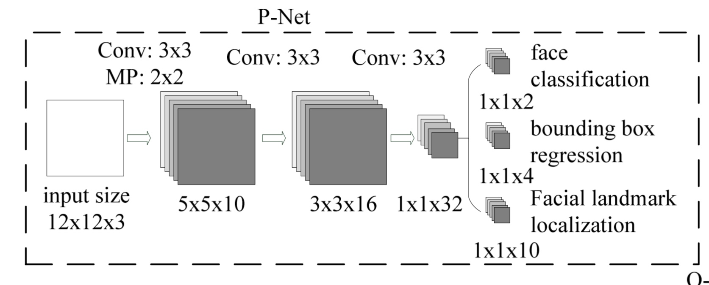

分享两个github开源的实用工具

本文介绍两个比较实用的开源工具，非常适合咱图像算法工程师

---

### 一、Alfred

[Alfred](https://github.com/jinfagang/alfred)是一个用于深度学习的命令行工具，源码使用python编写，并且作者一直在维护更新。

那么，这到底是一个啥样工具？

Alfred包含几个模块，例如data、cab、vision模块等

**在data模块中，可以直接在命令行输入命令查看标注的数据信息，查看是否有标注错误**

```shell
# 显示VOC标注
alfred data vocview -i JPEGImages/ -l Annotations/
# 显示COCO标注
alfred data cocoview -j annotations/instance_2017.json -i images/
# 显示txt标注
alfred data txtview -i images/ -l txts/
```


**在cab模块中，可以直接使用命令处理训练样本**

```shell
# 查看文件夹内jpg格式文件数量
alfred cab count -d ./images -t jpg
# 将数据集按比例分成train和val
alfred cab split -f all.txt -r 0.9,0.1 -n train,val
```

**在vision模块中，可以直接处理视频和视频帧**

```shell
# 将video提取成单帧图片
alfred vision extract -v video.mp4
# 将多帧图片组成一个video
alfred vision 2video -d images/
```

**还有更多**

如果你想在百度图片上获取大量的图片，alfred还集成了图片爬虫功能

```shell
#如果你想获取“马”的图片
alfred scrap image -q '马'
```


**甚至**

**可以用来计算在测试集上mAP**



**可以用来显示3D点云信息**


还有更多功能，这里就不一一列举

安装非常简单

```shell
sudo pip3 install alfred-py
```

使用方法

```shell
alfred -h
```

### 二、comparxiv

对于算法工程师而言，肯定是要经常上arXiv找文章的，arXiv的特点是文章比较新。因为很多作者一般都是习惯先在arXiv上挂出来，然后再慢慢发表到其它学术期刊，由于arXiv的文章是不需要审核，因此一般被用作发表手稿或者预出版的论文，那么一些优秀的论文一般都会有很多个版本，这里介绍的这个工具就是用来对比arXiv上文章版本，并标出pdf中的改动。



有了这个[comparxiv](https://github.com/temken/comparxiv)工具之后，一些比较新的文章，跟进的时候就可以随时查看版本的变化。

安装方法也很简单

```
pip install comparxiv
```

使用工具对比两个版本之后，可以生成一个新的PDF，不同的地方会被标红。

对于arXiv上的文章，我曾经也注意到一次。

当年研究MTCNN的时候，直接去arXiv下载了文章进行阅读，后来跟同事进行技术分享的时候，他们表示我的图有问题，网络结构中Max Pooling的参数和他们看的不一样。




上图是arXiv中的网络结构模型图，下图是官方挂出来的。

在github的issue里面，作者表示2x2的版本是正确的。

所以在这里呼吁各位童鞋，arXiv上的文章多留个心眼，多留意文章版本迭代。