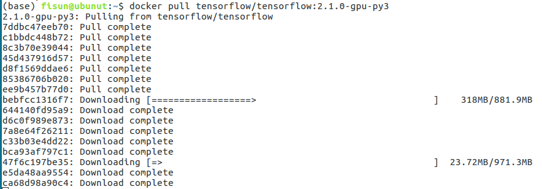
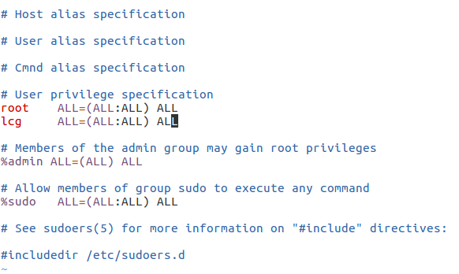
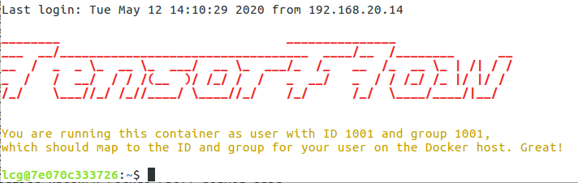
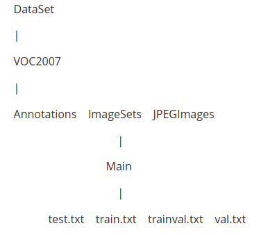
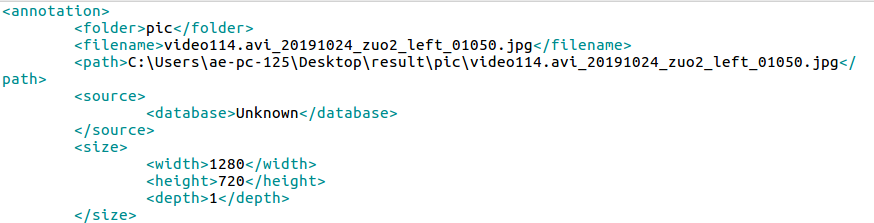
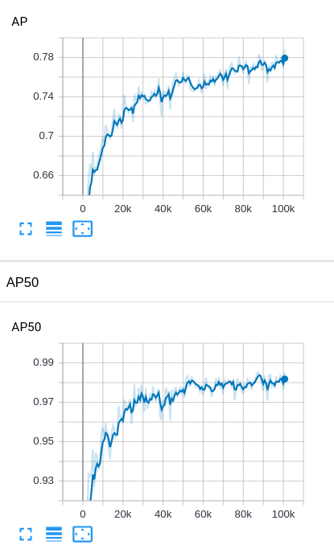
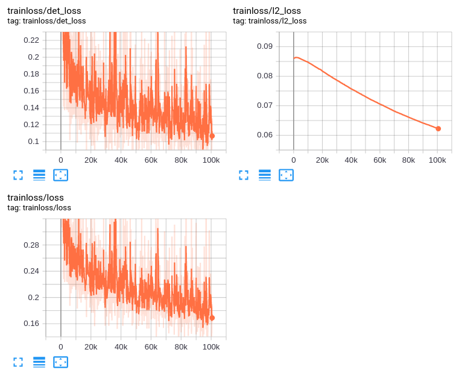
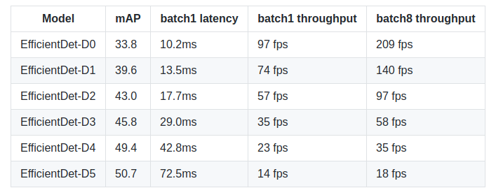
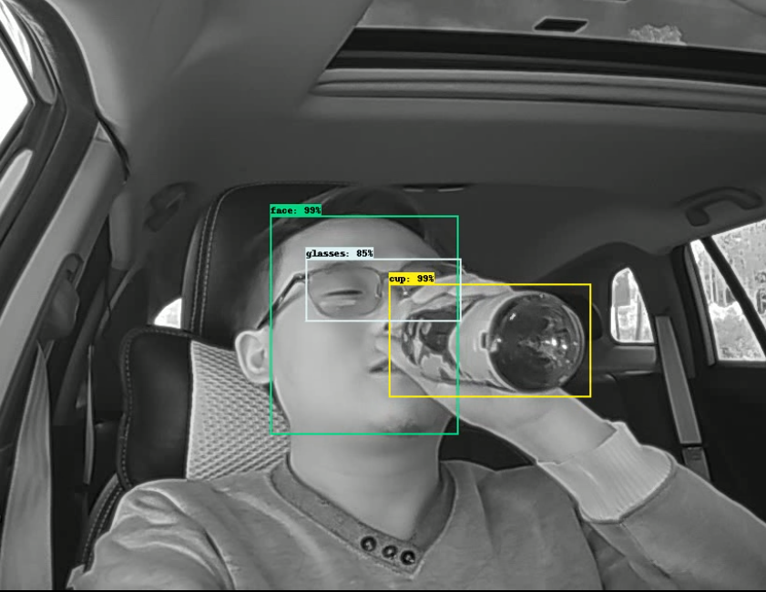

## Docker部署官方tensorflow版本EfficientDet

[官方版本EfficientDet](https://github.com/google/automl/tree/master/efficientdet)依赖环境为tensorflow2.1.0，python版本为3；而tensorflow2.1.0gpu版本又依赖于cuda10.1，为了不对本机环境产生影响，所以采用docker部署

### 一、官方镜像下载

在tensorflow官方[镜像地址](https://hub.docker.com/r/tensorflow/tensorflow/tags)copy下载命令，复制到host机器的终端运行



如果pull过程很慢，那就更换国内docker镜像源

```shell
vim /etc/docker/daemon.json
```

编辑daemon.json文件

```json
{
  "registry-mirrors": ["https://docker.mirrors.ustc.edu.cn"]
}
```

下载完成之后，查看镜像

```shell
docker image ls
```

### 二、容器创建

#### NVIDIA Docker 支持

在docker里面运行需要cuda的支持，所以先安装nvidia的docker镜像

```shell
# Add the package repositories
distribution=$(. /etc/os-release;echo $ID$VERSION_ID)
curl -s -L https://nvidia.github.io/nvidia-docker/gpgkey | sudo apt-key add -
curl -s -L https://nvidia.github.io/nvidia-docker/$distribution/nvidia-docker.list | sudo tee /etc/apt/sources.list.d/nvidia-docker.list

sudo apt-get update && sudo apt-get install -y nvidia-container-toolkit
sudo systemctl restart docker
```

检查是否安装成功

```shell
#### Test nvidia-smi with the latest official CUDA image
docker run --gpus all nvidia/cuda:10.0-base nvidia-smi

# Start a GPU enabled container on two GPUs
docker run --gpus 2 nvidia/cuda:10.0-base nvidia-smi

# Starting a GPU enabled container on specific GPUs
docker run --gpus '"device=1,2"' nvidia/cuda:10.0-base nvidia-smi
docker run --gpus '"device=UUID-ABCDEF,1"' nvidia/cuda:10.0-base nvidia-smi

# Specifying a capability (graphics, compute, ...) for my container
# Note this is rarely if ever used this way
docker run --gpus all,capabilities=utility nvidia/cuda:10.0-base nvidia-smi
```


#### 运行容器

下面两种方式都可以，指定runtime是docker2的写法

```shell
docker run -itd --runtime=nvidia -e NVIDIA_VISIBLE_DEVICES=all --restart=always --shm-size 1G -p 5522:22 -v /opt:/opt -v /home:/home -v /mnt:/mnt --name lcg_tf2.0.1 tensorflow/tensorflow:2.1.0-gpu-py3 /bin/bash
```

```
docker run -itd --gpus all --restart=always --shm-size 1G -p 5522:22 -v /opt:/opt -v /home:/home -v /mnt:/mnt --name lcg_tf2.0.1 tensorflow/tensorflow:2.1.0-gpu-py3 /bin/bash
```

5522是端口号，将docker的22端口映射到host的5522端口上

#### 创建容器内服务

1、创建容器内部用户

进入容器

```shell
docker attach <容器ID>
```

进入容器之后，默认的是root用户

```shell
#创建用户组lcg 制定组ID 1001
groupadd -g 1001 lcg
#添加一个用户到lcg组并指定id为1001
useradd lcg -g lcg -u 1001 -m -s /bin/bash
#修改用户密码
sudo passwd lcg
#安装常用的软件
apt-get update
apt-get install language-pack-zh-hans uuid-dev libtiff5-dev -y
apt-get install net-tools vim 

```

给lcg用户赋予root权限

```shell
apt-get install sudo
#编辑/etc/sudoers文件
vim /etc/sudoers
```

如下图



2、创建SSH服务

```shell
apt-get update
apt-get install -y openssh-server
sed 's@session\s*required\s*pam_loginuid.so@session optional pam_loginuid.so@g' -i /etc/pam.d/sshd
$ echo "export VISIBLE=now" >> /etc/profile
```

然后建立一个配置文件夹并进行必要的配置：

```shell
mkdir /var/run/sshd
sed -i 's/PermitRootLogin prohibit-password/PermitRootLogin yes/' /etc/ssh/sshd_config
```

重启SSH激活配置

```shell
service ssh restart
```

测试是否生效

```shell
#在host机上测试docker的端口转发
docker port <container_name> 22
#如果配置生效了，会出现0.0.0.0:5522
```

使用ssh链接docker

```shell
ssh lcg@192.168.xx.xx -p 5022
```




Docker常用操作

```shell
#列举出正在运行的容器
dokcer ps
#列举出所有容器
docker ps -a
#获取容器信息
docker container ls -a
#如果要删除的容器还在运行状态，那么先停止容器
docker container stop <container ID>
#找到要删除的容器的ID，进行删除
docker container rm <container ID>
#删除镜像
docker image rm <image ID>
```

### 三、测试tensorflow环境

首先进入python环境

```shell
python
```

在python环境下

```python
import tensorflow as tf
tf.test.gpu_device_name()
```

测试环境成功，则可以进入训练代码调试了

### 四、准备数据

将自己标注数据整理为voc格式，EfficientDet中datasets下面有有create_pascal_tfrecord.py脚本，可以将pascal格式数据转换为tfrecord数据

voc2007格式为



在create_pascal_tfrecord.py脚本中转换数据的时候，会在xml文件中读取folder，filename等字段



但是有个问题就是，标注图片信息的时候，往往是很多人用labeImg一起标注，然后最后汇总的，所以导致folder和path跟真实存储路径是不一样的，所以在脚本中需要进行一点修改。

```shell
PYTHONPATH=".:$PYTHONPATH"
python dataset/create_pascal_tfrecord.py      --data_dir=VOCdevkit --year=VOC2012  --output_path=mytfrecord/pascal  --set=trainval
```

运行完成之后，会在output_path路径下生成100个tfrecord文件

### **五、训练**

直接在EfficientDet目录下，运行mian.py文件即可，然后需要配置一些参数

```shell
python main.py \
--mode=train_and_eval \
--training_file_pattern=output_tfrecord/*.tfrecord \
--validation_file_pattern=output_tfrecord/*.tfrecord \
--val_json_file=output_tfrecord/json_output_tfrecord.json \
--model_name=efficientdet-d1 \
--model_dir=tmp/efficientdet-d1-scratch \
--ckpt=efficientdet-d1 \
--train_batch_size=4 \
--eval_batch_size=1 \
--eval_samples=512 \
--hparams="num_classes=5,moving_average_decay=0" \
--use_tpu=False
```

然后就开始训练

目前EfficientDet的官方版本的代码一直在更新，截止到目前(2020年5月19日)，最近的一次push是20小时之前，所以每一次的命令执行显示都会有所不一样。

一个月前，代码里面的很多东西还是使用tensorflow1的API写的，但是到现在很多tf1的写法都逐渐被改成了tf2的写法。





训练的效果还算不错，但是继续训练会需要一点trick

### 六、测试

#### 1、导出模型

将ckpt文件导出为pb文件，顺便还可以生成tflite

```shell
python model_inspect.py \
--runmode=saved_model \
--model_name=efficientdet-d1 \
--ckpt_path=efficientdet-d1 
--saved_model_dir=savedmodeldir \
--tflite_path=efficientdet-d1.tflite
```

命令运行完成之后，在savedmodeldir目录下将会得到pb文件和tflite文件

#### **2、时间测试**

完成pb模型的导出之后，可以测试一下模型的latency，这里网络推理时间测试是指的是从第一个卷积到最后一个prediction output的计算时间，不包括前处理和后处理，例如图像归一化，NMS等都不包括

```shell
python model_inspect.py \
--runmode=bm \
--model_name=efficientdet-d1 \
```

如果需要end2end的测试时间，可以运行一下命令

```shell
python model_inspect.py \
--runmode=saved_model_benchmark \
--saved_model_dir=/path/ientdet-d1frozen.pb \
--model_name=efficientdet-d1 \
-input_image=testdata/img1.jpg  \
--output_image_dir=/tmp/  
```

下面是在V100上测试的结果



#### **3、测试自己的图片**

```shell
python model_inspect.py --runmode=saved_model_infer \
  --model_name=efficientdet-d0  \
  --hparams="image_size=1920x1280"  \
  --saved_model_dir=/tmp/saved_model/efficientdet-d0_frozen.pb  \
  --input_image=img.png --output_image_dir=/tmp/
```



**切换CPU模式和GPU模式**

有两种方式，第一种是直接在终端shell中设置，第二种是在代码中设置

```shell
#终端中设置
export CUDA_VISIBLE_DEVICES=-1
```

```python
#代码中设置
import os
os.environ["CUDA_VISIBLE_DEVICES"] = "-1"
```

在2080Ti上测试batch_size=1，推理时间大约21ms

在CPU单线程模式下，大约230ms


