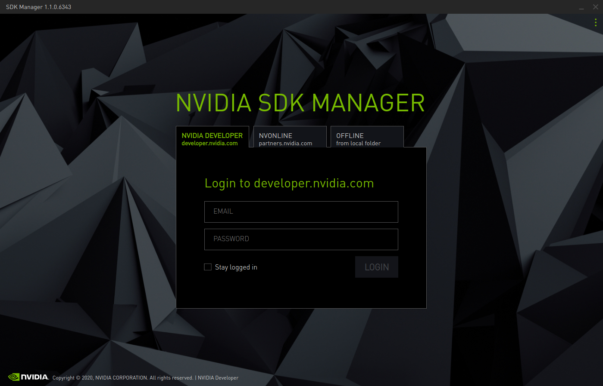
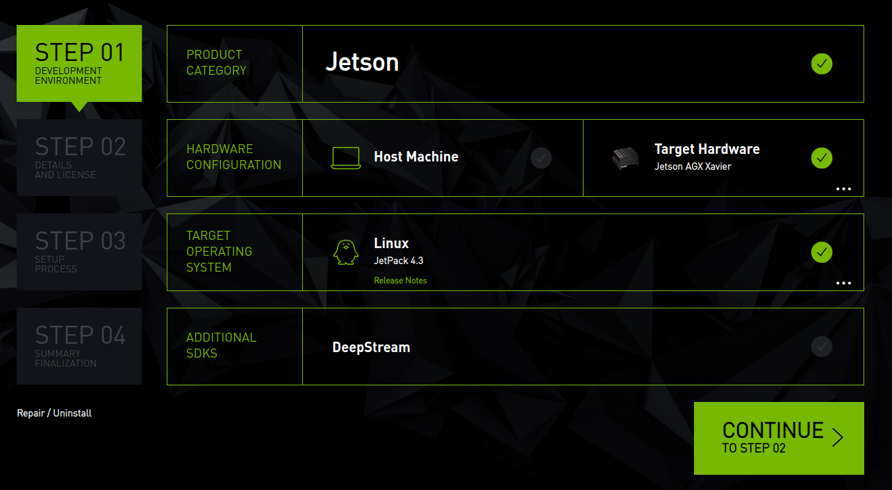
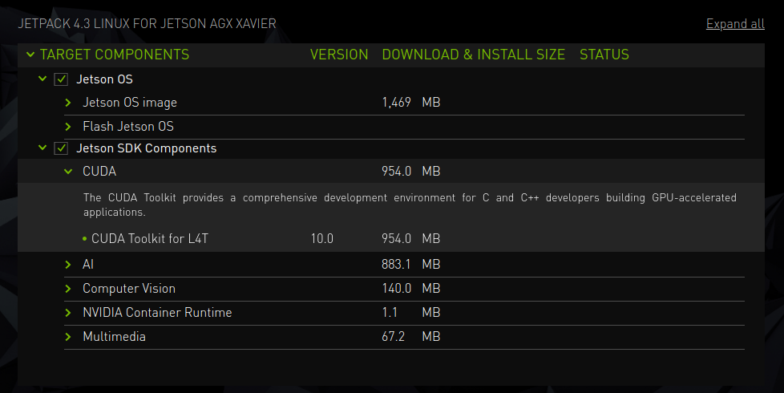
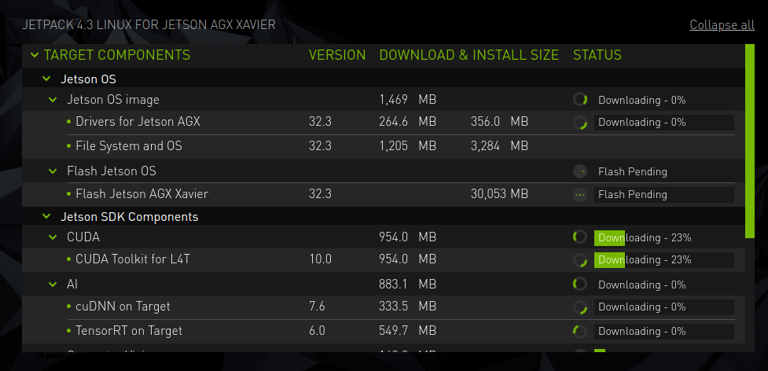
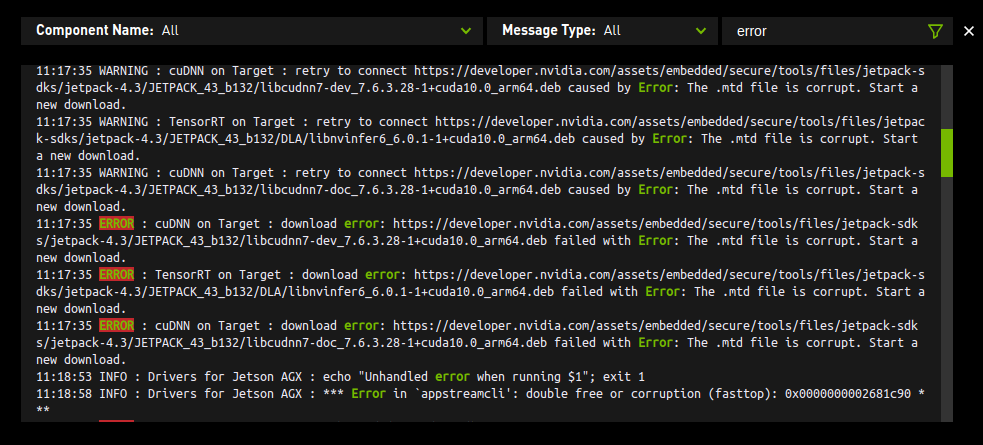
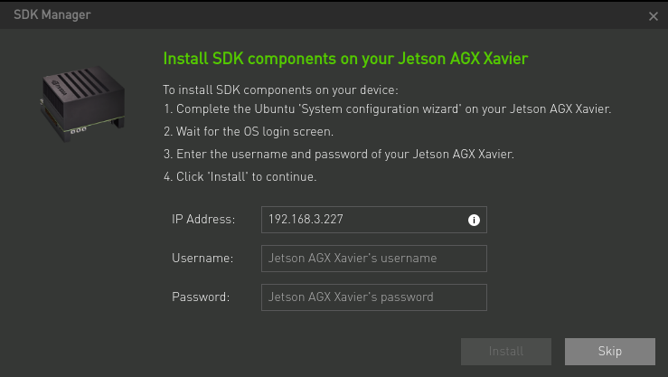
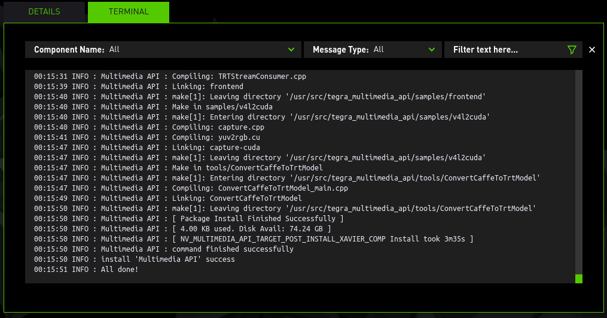
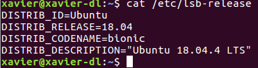
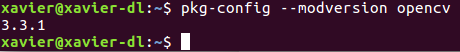

Xavier刷机

拿到Xavier之后，默认系统开机就和电脑上重装系统之后一样的。设置用户名，设置密码，设置语言，设置时区。

进入系统之后，就是找不到cuda和opencv。

OK，Xavier原厂默认系统是不包含cuda，cudnn的，甚至于连opencv都没有。所以需要自己动手重新刷机

### 一、准备下载工具

现在NVIDIA提供了SDKManeger的工具，相比于之前的Jetpack界面更加友好

[SDKManager下载](https://developer.nvidia.com/nvidia-sdk-manager)

[官方参考教程](https://docs.nvidia.com/sdk-manager/install-with-sdkm-jetson/index.html)

我这里下载的是SDK manager1.1.0版本

```shell
sudo dpkg -i sdkmanager_1.1.0-6343_amd64.deb
```

安装完成之后运行软件



在此之前一定要先注册一个nvidia的开发者账号，使用账号登录即可，登录不需要梯子。

登录完成之后会进入选择界面



Host Machine是指你现在运行的本机是否需要安装环境，这里不需要，取消选中

Target hardware选择 Jetson AGX Xavier

Target operating system选择Jetpack的版本，这里可以选择预览版，目前4.4是属于预览版，我选择Jetpack4.3

然后选择继续



这里可以确认cuda，cudnn，tensorRT版本，确认无误就可以开始下载



在电脑下载的过程中，可以先去准备原装的typeC的连接线，然后准备网线。

在安装过程中很容易出现下载失败的情况，如下图所示。这都是墙导致的，如果有梯子，可以用梯子再试一次。如果没有梯子那就只能重复试，夜晚夜深人静的时候成功率高




### 二、开始刷机

下载完成之后会变成一个页面，自动模式下需要输入xavier的IP地址，通过ssh安装。这里选择手动模式。

- 断电状态下使用原装typeC数据线连接xavier和host电脑
- xavier上电，先按一下电源键，然后按住recovery键(电源旁边那个)，然后按住recovery键不放的同时，按一下reset键马上放开，然后保持recovery键按住两秒钟

在host电脑上终端查看是否找到xavier

```
lsusb
```

若终端显示nvidia字样的设备，则证明xavier成功进入刷机模式，连接正常。

然后在SDKmanager软件界面操作下一步

软件会先给xavier刷系统，如果xavier连接了显示器，显示器会显示已经进入了系统。然后在新系统中设置用户名密码

进入xavier的新系统，查看xavier的ip地址，然后将信息输入到host主机的SDK Manager界面中



这里是通过ssh连接xavier，然后安装软件。一般情况下，这里都会失败，还是因为墙，所以需要将xavier的源换一个

在终端执行以下命令

```shell
sudo cp /etc/apt/sources.list /etc/apt/sources.list.backup
sudo gedit /etc/apt/sources.list
```

删除所有内容后，添加如下内容：

```
deb http://mirrors.tuna.tsinghua.edu.cn/ubuntu-ports/ bionic-updates main restricted universe multiverse
deb-src http://mirrors.tuna.tsinghua.edu.cn/ubuntu-ports/ bionic-updates main restricted universe multiverse
deb http://mirrors.tuna.tsinghua.edu.cn/ubuntu-ports/ bionic-security main restricted universe multiverse
deb-src http://mirrors.tuna.tsinghua.edu.cn/ubuntu-ports/ bionic-security main restricted universe multiverse
deb http://mirrors.tuna.tsinghua.edu.cn/ubuntu-ports/ bionic-backports main restricted universe multiverse
deb-src http://mirrors.tuna.tsinghua.edu.cn/ubuntu-ports/ bionic-backports main restricted universe multiverse
deb http://mirrors.tuna.tsinghua.edu.cn/ubuntu-ports/ bionic main universe restricted
deb-src http://mirrors.tuna.tsinghua.edu.cn/ubuntu-ports/ bionic main universe restricted
```

这里的步骤非常关键，如果不更换源，那么安装速度将会非常慢，慢到怀疑人生。

修改文件之后

```shell
sudo apt update
sudo apt upgrade
```

最后在SDK Manager中继续，然后就开始安装。

最后成功的界面如下所示




### 三、验证环境

**查看Jetson Xavier L4T版本**

```shell
head -n 1 /etc/nv_tegra_release
```
 R32 (release), REVISION: 3.1, GCID: 18284527, BOARD: t186ref, EABI: aarch64, DATE: Mon Dec 16 21:38:34 UTC 2019

**查看TensorRT的版本**

```
dpkg -l | grep TensorRT
```


**查看系统版本**

```
cat /etc/lsb-release
```



**查看opencv版本**

```shell
pkg-config --modeversion opencv
```

