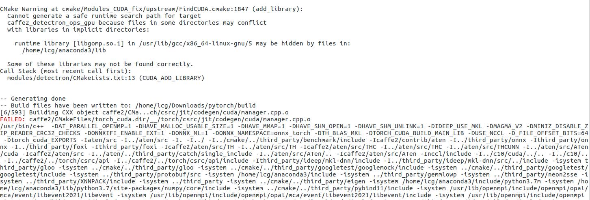
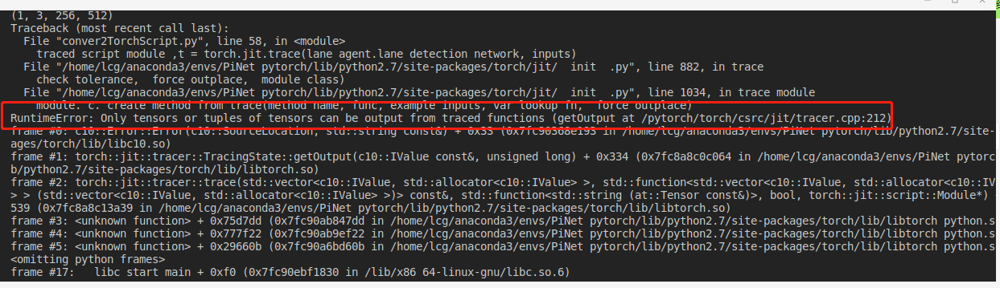
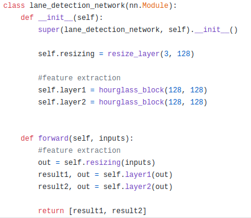
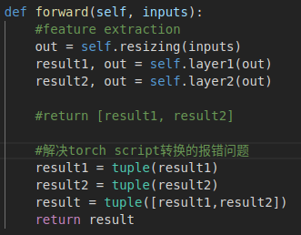

pytorch的C++部署

官方自从pytorch1.0开始就支持c++的API，官方称之为libtorch

安装libtorch有两种方式

- 直接下载官方编译好的库文件
- 从源码编译

这里我试一下源码编译安装libtorch

---

按照[pytorch github](https://github.com/pytorch/pytorch/#Installation)页面的说明，进行配置


## x86平台实验

**1、x86平台编译**

在pc端编译官方建议使用conda安装依赖项

```shell
conda install numpy ninja pyyaml mkl mkl-include setuptools cmake cffi typing
```

安装gpu依赖

```shell
conda install -c pytorch magma-cuda100
#cuda-100代表cuda10.0，cuda10.1就是cuda-101
```

获取源码

```shell
git clone --recursive --branch <version> https://github.com/pytorch/pytorch
#如果需要下载1.4.0版本，那么version为v1.4.0
```

编译

```shell
export CMAKE_PREFIX_PATH=${CONDA_PREFIX:-"$(dirname $(which conda))/../"}
python setup.py install
```

编译源码出现错误




2、c++部署pytorch模型

https://pytorch.org/tutorials/advanced/cpp_frontend.html

https://pytorch.org/tutorials/advanced/cpp_export.html

1、将模型转为Torch Script

有两种方式进行转换

- tracing
- add explicit annotation to model

使用tracing转换

```python
import torch
import torchvision

# An instance of your model.
model = torchvision.models.resnet18()

# An example input you would normally provide to your model's forward() method.
example = torch.rand(1, 3, 224, 224)

# Use torch.jit.trace to generate a torch.jit.ScriptModule via tracing.
traced_script_module = torch.jit.trace(model, example)
```

序列化生成文件

```python
traced_script_module.save("traced_resnet_model.pt")
```

尝试转换PiNet模型

在转换过程中出错



原因是PiNet中forward输出是一个list



然后修改forward的返回值形式



暂且可以转换成功！！

下一步，写c++工程


Jetson平台编译


pc端直接下载libtorch包

https://download.pytorch.org/libtorch/cu100/libtorch-shared-with-deps-latest.zip