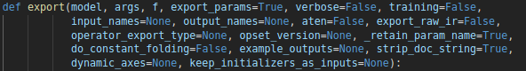

Xavier上pytorch模型的TensorRT部署

### 一、安装依赖

**jetson平台**

如果是在Jetson平台安装，由于tensorRT在刷机的时候就已经安装好了，所以直接安装以下三个

```shell
#安装boost
sudo apt-get install libboost-all-dev
#安装glog
sudo apt-get install libgoogle-glog-dev
#安装pycuda
pip install -i https://pypi.tuna.tsinghua.edu.cn/simple pycuda
```

**x86平台**

如果是在x86平台ubuntu下安装

```shell
#下载TensorRT并解压
sudo cp -R TensorRT-5.0.2.6/targets/x86_64-linux-gnu /usr/local/TensorRT-5.0.2.6
#添加环境变量
export LD_LIBRARY_PATH=/usr/local/TensorRT-5.0.2.6/lib:$LD_LIBRARY_PATH
#安装python的tensorRT
cd TensorRT-5.0.2.6/python
pip install tensorrt-5.0.2.6-py2.py3-none-any.whl
```

```shell
#安装boost
sudo apt-get install libboost-all-dev
#安装glog
sudo apt-get install libgoogle-glog-dev
#安装pycuda
pip install -i https://pypi.tuna.tsinghua.edu.cn/simple pycuda
```

### 二、pytorch模型转onnx

pytorch模型转换程序已经被集成到pytorch中了，但是需要注意的是不同的pytorch版本的生成的onnx版本也会不一样

其实核心的转换代码就一行

```python
torch.onnx.export(model,
                  inputs,
                  onnx_file)
```



可能会有不同版本的onnx不能通用的情况，不同版本的onnx，export函数参数默认值也许都不一样