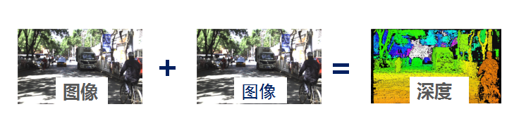
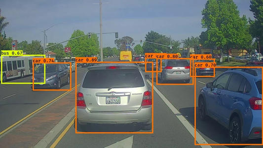
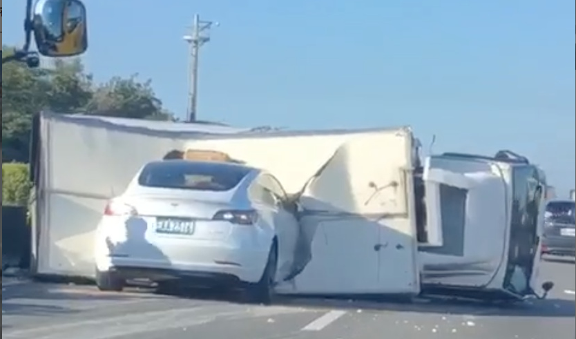
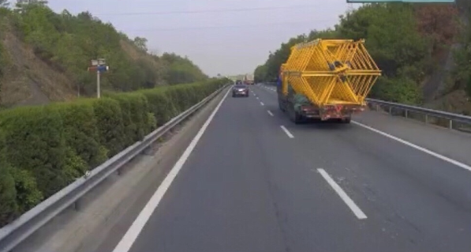
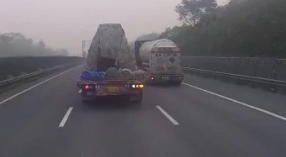
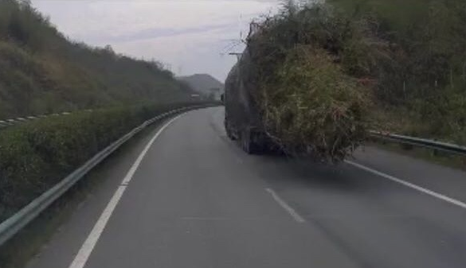
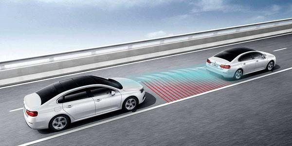
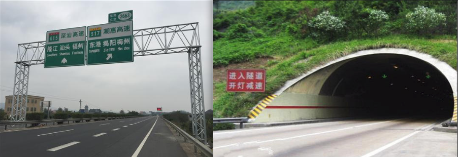
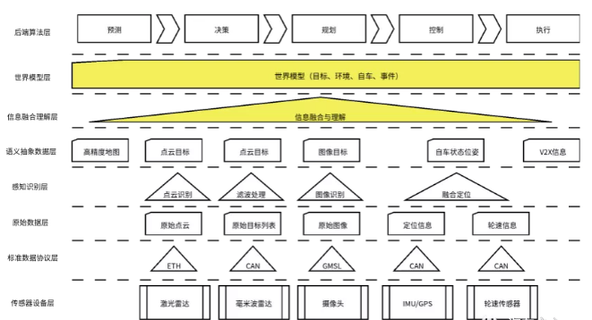
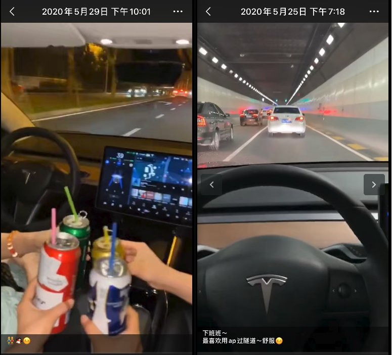

上面视频中的交通事故发生在2020年6月1日的台湾嘉义

根据媒体报道出来的消息，车辆是特斯拉的model3，在开启了特斯拉的AP(自动辅助驾驶)功能的情况下撞进了一辆翻倒的货车车厢，车头损毁不算太严重，因为车辆的安全气囊都没达到弹出的条件，所以司机基本无恙。

在这个事故中，我想站在自动驾驶感知算法的角度，从技术层面做一个简单的分析。

---

首先，这次事故的核心问题

**为什么特斯拉在开启了AP(自动辅助驾驶)模式的情况下，系统却没感知到障碍物**？

下面的介绍将全部围绕这个问题展开

### 一、特斯拉的视觉感知

感知系统，顾名思义就是汽车通过车身的一系列传感器来获取驾驶环境中信息的一套系统，就好比驾驶员的眼睛。

Model3这辆车的感知系统由三部分组成：摄像头、毫米波雷达、超声波雷达

Model 3 总共配置有8个摄像头，基本上做到让全车无死角的照顾到了。其中三个摄像头负责前视方向上的识别，如下图

这三个摄像头的参数都不一样，其功能职责也不一样

**主视野摄像头**：范围可达150米，视野能覆盖大部分交通场景。

**鱼眼镜头**：视野120度，范围60米，能拍摄到交通信号灯、行驶路线上的障碍物和距离较近的物体，适用于城市街道、低速缓行的交通场景。

**长焦距镜头**：视野相对较窄，适用于高速行驶的交通场景，可以识别最远250米的物体。同时做行车记录仪使用。

众所周知，摄像头的输出信息是一副图像，也就是一个2D的矩阵，这个信息里面是没有深度信息的，例如我们用手机拍照，照片里面的物体是没有距离信息的，我并不知道这个物体距离手机有多远。

目前，自动驾驶视觉感知中，获取深度信息最常用的一种方法是双目视觉，类似于人的两只眼睛，通过两只眼睛的成像的视差，来判断距离。人判断物体距离也是这样，不信你捂住一只眼睛，再去用手抓东西，感知能力肯定变弱。

早期，我以为这三个摄像头会有联合算法输出深度信息，经过一系列的求证之后，发现并没有，这三个摄像头的算法是独立工作的，只是在输出目标之后再进行融合。也就是在三个摄像头画面中分别进行目标检测，然后再进行信息汇总。识别原理类似于单目，和双目RGB-D的原理不同。

这样就有一个问题，车辆的视觉感知能力极大地依赖目标检测算法。

OK，我们再来简单聊聊目标检测算法

目标检测系统识别效果优秀有两个前提

1、画面成像质量好。例如遇到强光，画面大面积白色，再厉害的识别算法都识别不出来的。

2、识别算法训练的样本满足大规模的场景分布。如果车辆前方障碍物是识别算法已经学习过的东西，那么识别出来很容易；如果一个场景根本没有在算法训练中遇到过，那么有可能是识别不出来的。

**我觉得这次事故中，上面两个因素都有。**

翻倒的货车，通体白色，很容易造成视觉上强反光，不容易被识别。

然后，特斯拉的工程师们想破脑子估计也想不出高速路上会横躺着这么一个玩意儿。虽然特斯拉是地球上第一个实现数据闭环(直接由用户贡献数据的模式)的自动驾驶公司，但是数据量也顶不住这个全身白色横躺着的货车。

感知系统没学习过这类数据，它就很难识别的好。例如下面这些

现阶段视觉的目标识别方法，虽说是人工智能，但是核心还是“有多少人工才有多少智能”，没有人工的数据就一定会导致系统识别问题，场景再少也不代表不会出现，没有遇到之前可能是99.999%的可靠性，遇到了那就是100%的事故。

这就是自动驾驶中经典的长尾效应，你可以无限往99.9之后加9，但是永远无法得到100。

OK，到这里可能有人会问，即使摄像头没有识别，车载的 77G 毫米波雷达也应该能识别障碍物。

### 二、特斯拉的毫米波雷达

特斯拉的前视感知系统是3V1R 的架构，也就是3个视觉传感器加上一个雷达。目前的特斯拉反感以视觉为主，雷达为辅。这里的雷达是毫米波雷达(Radar)，并不是激光雷达(Lidar)。

马斯克曾经说过，自动驾驶使用激光雷达，就好比是人走路使用拐杖。他是非常反感使用激光雷达的。其实最根本原因是激光雷达成本高，一台激光雷达可以买好几百个摄像头了。

毫米波雷达的原理就是：把无线电波发射出去，然后接收回波，根据多普勒效应来计算距离。

毫米波雷达波的反射跟反射面的材质有关，毫米波穿透性强，但是对金属敏感，也就是说只要是金属面一定能产生回波的。

OK，那按道理说，这起事故中即使视觉失效了，雷达应该也探测到了才对啊。

这就跟感知系统中处理雷达信号的方式有关了，引用知乎上一段话

> 对毫米波雷达来说，主要是受目标对电磁波反射敏感度影响，有些橡胶类静态物反射不好，识别会困难。此外，雷达几乎无法区分龙门架、道路侧面的金属标牌或道路上停放的静止汽车，因为雷达的空间分辨率很差，**在算法上只能通常忽略相对于路面不移动的雷达回波**。否则，每次经过路标等静物时，汽车都会惊慌失措。”顾剑民补充道。

也就是说毫米波雷达很难识别静止的大平面物体。

事实上，静止物体是有意被滤波算法去除的，毫米波雷达对速度的感知是通过多普勒效应来实现的，所有的物体都会产生回波，而只有去除杂波，才可以关注真正需要跟踪的物体。如果不去除静止物体，那么车只要经过隧道口，龙门架之类的地方，那么必然会刹停。

所以说，静止的物体产生的回波信号是被工程师刻意地过滤掉的。

这场事故从技术角度分析，那就是视觉感知没识别出来，毫米波雷达识别出来系统又选择不相信。实际使用中目前的大多数L2级(model3也是L2)都无法在高速状态下识别静止物体，别以身试车了。

那么，又有人有疑问了，如果把视觉信号和雷达信号融合呢？不要一味地相信视觉而忽略雷达。

这个问题，工程师们也早就想到了。

### 三、视觉和雷达融合

特斯拉选择以视觉为主雷达为辅的感知策略，主要还是因为他们的视觉算法做的很牛逼和毫米波雷达自身的局限性。

下图是常见的自动驾驶异质数据融合的框架

特斯拉的方案中，视觉和毫米波雷达融合肯定是有的，但是毫无疑问，视觉感知中没有深度信息的输出绝对是一大短板。

> 在今年2月份的Scaled Machine Learning大会上，特斯拉就分享了如何仅用几个摄像头获得传统激光雷达精度的技术。通过将视觉传感器（摄像头）收到的视觉信息进行3D渲染、用人工智能（AI）软件将车道线、交通、行人等信息与进行匹配，最终使车辆作出决策。目前，特斯拉将计算机视觉提升到了前所未有的水平，不仅能够分析图像，而且还能够分析图像中的单个像素。随着时间推移，这样做也许能够复制传统激光雷达的大部分功能，这意味着可以利用已经为激光雷达处理开发的所有软件解决方案，或将进一步提高特斯拉在3D物体探测方面的技术水平。

上面的新闻，也反映出了特斯拉在视觉算法上的先进之处，使用单目就有可能获得准确深度信息，也期待后续的OTA可以升级使用。

本人对融合算法不是很熟，所以就不多说了。

### 四、最后

大家一边觉得特斯拉在吹牛，一边又在用吹牛的指标来进行对标。

充其量，特斯拉也就在常见场景比一般的好。

那么，这次事故究竟是谁的锅呢？

model3的汽车使用手册中明确说明了，AP(自动辅助驾驶系统)不能脱离驾驶员使用，驾驶员必须时刻做好接管车辆的准备。

人都有一种惰性，当尝试过几次便利之后，只会更加乐意享受这种便利带来的愉悦感，开辅助驾驶的车就有这种愉悦感。

但是是什么原因导致这种愉悦感被膨胀？

是媒体！

是特斯拉的销售！

是特吹们的无脑吹！

我的朋友圈有特斯拉销售，我随便截取两张他们发的圈

他们吹的时候，只会说，哇，好牛逼，这才是AI！这样的话听多了，普通人真的会以为自动驾驶时代已经来临。

我作为一个感知算法工程师，也作为一名特吹，我相信特斯拉的技术，也明白辅助驾驶的危险性

**一句话：特斯拉的辅助驾驶可以用，但是别以为真的可以放手**

