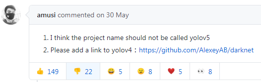
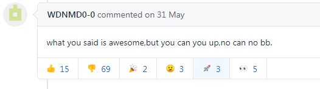
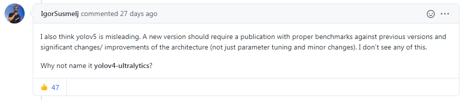
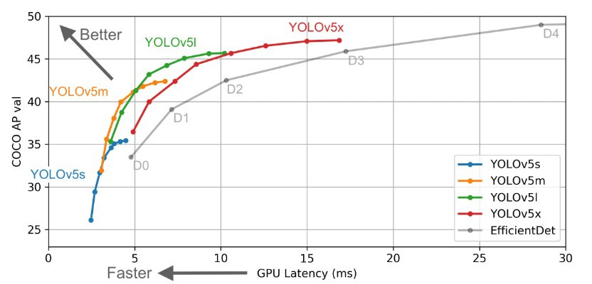
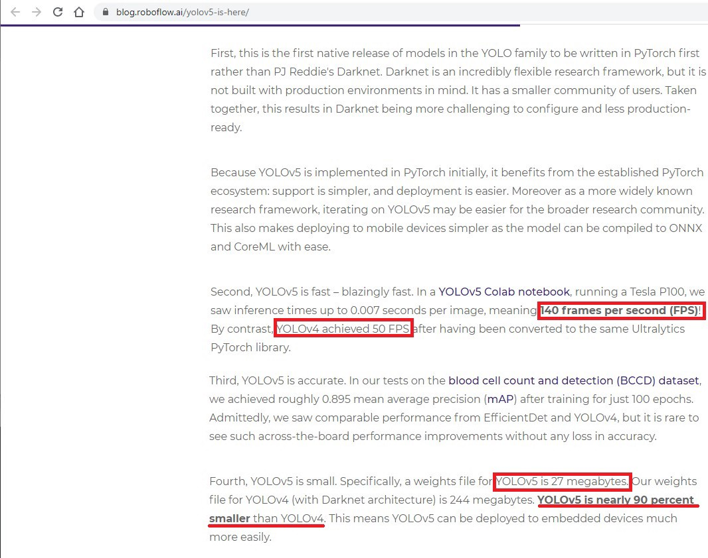
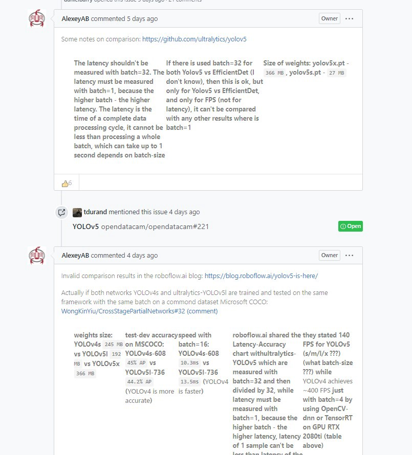
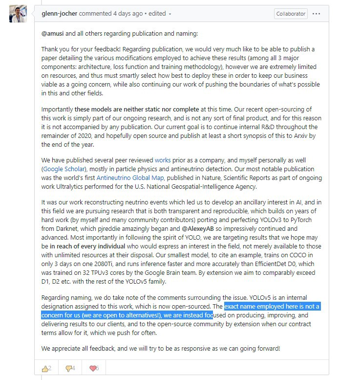
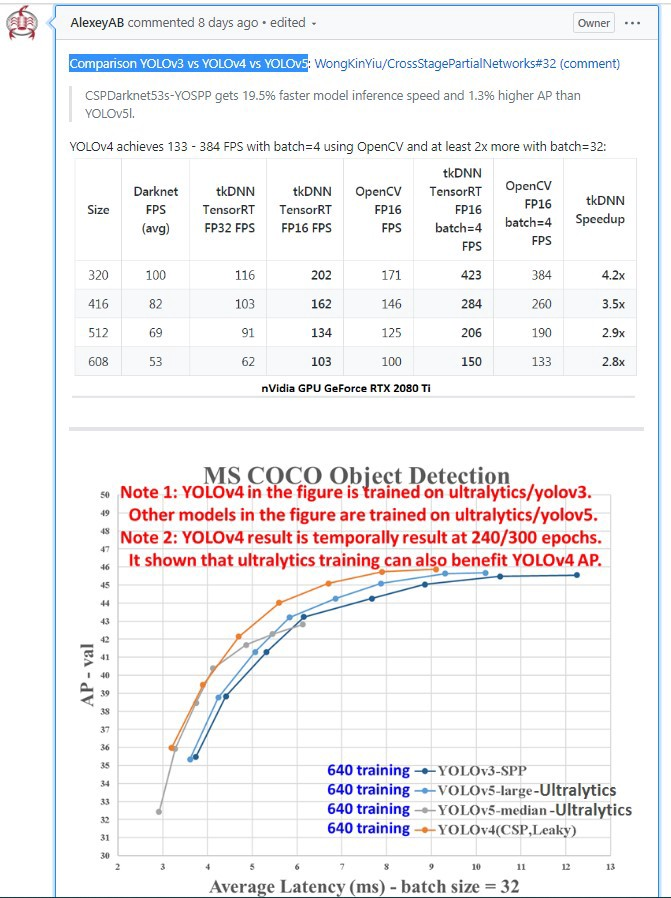

### YOLOV5目标检测----上手


2020年4月23日，YOLOV4开源

2020年6月10日，YOLOV5开源

这两个日子，可是把CV类公众号的运营者忙坏了，各大公众号都在忙着抢“首发”

当然，YOLOV4是货真价实的YOLO系列的第四个版本，虽然J.R大神宣布了“退役”，但是v4依然是其团队的研究成果，是具有正宗YOLO血统的

对于YOLOV5，其作者显然不是YOLO团队的，但是v5的作者也是yolo系列忠实粉丝。ultralytics团队实现的[pytorch版本的yoloV3](https://github.com/ultralytics/yolov3)，广受好评，在github上获得了5.2K的star。

在YOLOV5开源这一天，其repo上就有人发了issue，说不应该使用yoloV5这个名字。



在下面讨论区，两派的声音势均力敌。



这个“you can you up“,简直笑到我了！



对于我来说，这个命名也就是一个代号，不管你叫啥，只要性能牛逼，我就给你点star

---

#### 一、撕逼

我们现在回到YOLOV5这个算法上来



上图来自于yoloV5的repo，给出了不同大小v5模型和efficientDet的比较。

从图中可以看出，yoloV5不同大小的模型，其性能都优于efficientDet，但是有一点大部分人都觉得很奇怪，为啥没有跟yoloV4比较。既然名字都命名了V5，为啥没有与V4的对比实验。

[YoloV5 is here](https://blog.roboflow.ai/yolov5-is-here/)这篇博客中说了YOLOv5在Tesla P100显卡上运行超过140FPS，YOLOv4只能运行到50FPS；v5的模型大小是v4模型大小的十分之一，并且两者精度相当。

感兴趣的同学可以看下原文，截图如下。




到目前为止，YOLOV5还没有发表学术论文，ultralytics是一个公司，并不是一个学术组织。所以现在有很多人对github上发出来的对比数据是持怀疑态度的。详情可以看[讨论区](http://github.com/AlexeyAB/darknet/issue/5920)和[社区](https://www.kaggle.com/c/global-wheat-detection/discussion/158371)

甚至，AlexeyAB也直接在issue怼上了



AlexeyAB的态度很明确，u团队做对比实验不科学。拿着小模型的v5和大模型的v4比速度，然后也没提供输入分辨率和batch_size。然后AlexeyAB自己做了对比实验，数据如上图。

然后 Ultralytics团队的Glenn- Jocher，对此作出了[回应](https://github.com/ultralytics/yolov5/issues/2)。表示他们原有计划是要写一篇paper来展示实验过程的，但是由于公司资源限制，这个计划被推迟了。毕竟公司是要恰饭的，可以理解。



关于[YoloV4和YoloV5的对比测评]([https://blog.roboflow.ai/yolov4-versus-yolov5/])，可以看RoboFlow写的这篇文章。这篇文章从yolo的历史开始写起，讨论了命名和自定义数据下的性能。

下图是AlexeyAB实验对比数据，分别对比了v3，v4和v5



上面的内容基本都是围绕着命名和性能在讨论(撕逼)

但是对于我们算法狗而言，无所谓啦，只要能开源，你叫啥都行！

把开源的变成自己的，把自己的变成祖传的。

#### 二、训练自己的yoloV5


**1、配置环境**

```shell
git clone https://github.com/ultralytics/yolov5
pip install -U -r yolov5/requirements.txt
```

**2、转换数据格式**

将自己的xml或者json文件转换为yolo格式的txt文件

**3、选择模型大小**

可以选择yolo5s，yolo5m，yolo5l，yolo5x不同大小的模型，模型越大精度越高，速度也就相应越慢

**4、修改对应配置文件**

- data.yaml
- custom_yolov5m.yaml

训练过程可以参考yoloV5的wiki，也可以参考这个[训练repo](https://github.com/DataXujing/YOLO-v5)和[另外一个训练教程](https://blog.roboflow.ai/yolov5-improvements-and-evaluation/)

v5的训练速度还是很快的


我原来有个目标检测项目是使用pelee做的，由于硬件算力限制，不得已只能选轻量级的算法。所以yoloV5s和yolov5m对于轻量级算法选型应该是一个不错的选择。