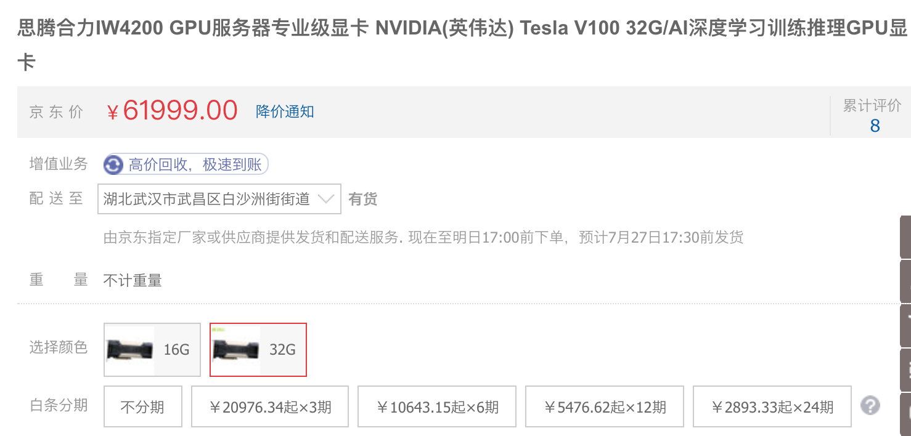
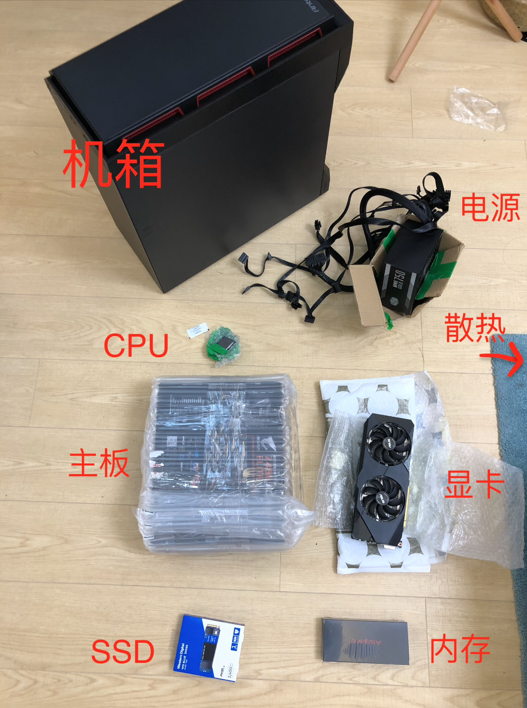
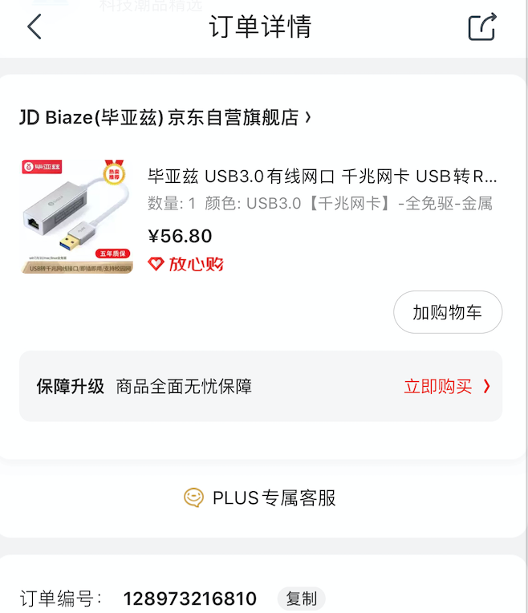

攒一台自己的深度学习主机

> 本来早就有组一台深度学习主机的打算了，刚好趁着这个星期事情不是很多，就终于把这个事情搞定了。
>
> 整个过程分为几个部分，首先是自己根据需求来列出配置单，然后根据配置单去各种渠道比价，最后收货之后开始组装。

先来看看我最后买到的配置单

| 配件   | 型号               | 价格 | 渠道 |
| ------ | ------------------ | ---- | ---- |
| 主板   | z490技嘉小雕       | 1300 | 咸鱼 |
| CPU    | i7 10700           | 2090 | 淘宝 |
| 显卡   | RTX2070 华硕       | 2500 | 咸鱼 |
| 硬盘   | 1T  m.2 西数蓝盘   | 711  | 京东 |
| 内存条 | 64G asgrad (32G*2) | 1198 | 淘宝 |
| 电源   | 750W 酷冷至尊      | ---  | --   |
| 散热器 | 水冷240            | 219  | 京东 |
| 机箱   | 安钛克 p101        | 379  | 京东 |

这台主机总花销8397元，在windows下鲁大师跑分 ，基本上每一项都是超过99%，所以基本上这个分数没太大参考意义了。

组这台主机，大概花了十天左右(摸鱼时间搞的)，前几天先列出自己的配置需求清单，后来几天找渠道买，最后两天装机配环境。

#### 一、配置

**1、显卡**

作为一只深度学习算法狗，这台主机的主要目的是做深度学习用。那么这台机器配置中C位绝对就是显卡了。

显卡分为两种，一种是科学运算级别的卡，一种是游戏级别的卡。科学运算级别的卡，我等屌丝在家里是享受不起了，V100 32G 直接六万多

这种科学计算型的卡，在公司或者在学校享受一下就行了，就个人来说肯定是不会搞的。

所以只能在游戏卡中选，对于做深度学习任务而言，大家普遍的关注点都在显存上，毕竟大的显存，也就意味着大的batch_size，大的batch_size会给任务带来更多的便利性。

目前主流的大显存卡(1万以下的)，主要有以下几个

| 型号      | 显存 | 价格 | 说明           |
| --------- | ---- | ---- | -------------- |
| RTX2080Ti | 11G  | 9000 |                |
| GTX1080Ti | 11G  | 6000 | 已停产，二手价 |
| RTX2080   | 8G   | 5000 |                |
| RTX2070   | 8G   | 3200 |                |
| RTX2060   | 6G   | 2200 |                |

以上价格都是京东上的参考价，目前RTX20系列的基本上已经停产，在售的都是s系列，例如RTX2070s，相比RTX2070贵1000左右，显存并没有提升。所以s系列的卡对于我来说，性价比不高。

我选显卡的宗旨是：**花最少的钱，上最大的显存**，GTX1080Ti虽说有11G显存，但是早已停产多年，以后万一驱动不更新或者cuda不支持，这可就不好玩了，所以排除1080Ti；RTX2060虽然便宜，但是只有6G显存，所以也是被排除；2080相比于2070，个人觉得还是2070性价比高；所以最后只剩下RTX2080Ti和RTX2070两款，有钱就上2080Ti，我没钱所以选择2070。

**2、CPU**

对于选CPU而言，有两家可选，Intel和AMD。大部分人都知道，同等性能情况下，AMD比Intel要便宜好几百。但是在咱们CV圈内有句话，叫做：**深度学习用AMD，不是傻就是穷**

。这里不仅仅是指A卡，而且也包括AMD的U。

曾经我听一个互联网程序员大佬说过，如果你想写出很牛逼的代码，那么就用AMD的cpu。因为如果在AMD的CPU上兼容性都没毛病，那么你发布的程序就稳了。

这里也正说明了AMD的CPU在兼容性方面是稍微差那么一丢丢的。

做深度学习，不管是训练还是推理，其实跟CPU算力的关系不算太大。所以i5或者i7倒没太大关系。

**3、主板**

主板的选择非常非常重要，仅次于显卡的选择。

首先，主板充当着CPU和GPU交互的枢纽角色，两者数据交换，如果带宽不够，要么是训练速度慢，要么是训练的时候电脑看代码都卡。

其次，主板直接决定了整个机器的时钟频率，CPU超频和内存超频，都直接依赖于主板的性能

最后，主板上PCIE插槽可以决定以后是否能加一块或者更多显卡。如果决定以后加显卡，那么选购主板的时候就要注意。

#### **二、选购**

选购自己的配置单，渠道有很多。首先最靠谱的当属京东自营，不管是正品保障还是售后，都不错。但是我既然作为一个垃圾佬，肯定是要多方渠道对比的。

例如，京东上七彩虹RTX2070，价格是3199，然后我去闲鱼蹲了一波，蹲到一个99新，华硕的2070

然后，对于CPU而言，散片和盒装在保证是全新的前提下，他们唯一的区别就是盒装自带Intel的散热风扇。自己装机，这个风扇肯定是得换的，所以就可以直接选择散片。散片也是Intel公司的正规产品，所以不存在质量差之类的说法。

对于硬盘和内存，这两类就不要买水货或者二手的了。因为这玩意儿水深，容易翻车。我经常会关注内存和硬盘的价格，如果有很大优惠的时候，我就会屯两根，偶尔送人或者加到老机器机器里面。我是在[张大妈](https://www.smzdm.com/)上设置了关注，如果有好价就会有提醒。

最后，机箱这玩意儿，就没必要买二手了。第一这玩意不贵，然后装机的螺丝啥的，新机都给配齐活了，新机靠谱。

#### 三、安装

买回来的东西，差不多就这么多，然后就可以开始组装了。组装电脑主机，其实没太大技术含量，小白对着说明书边看边装，也没啥困难，顶多就是慢一点，但是可以享受到装机过程中的无穷乐趣。

基本上所有的接口都是有防呆设计的，如果接口插不上去，那就只有插错了这一种可能。所以说装机难度并不大。

装机完成之后，刷系统，配环境。

然后就可以愉快的coding了！

---

然鹅。。。

事情并不是那么顺利！

当我顺利装完windows系统之后，跑完鲁大师，我以为我成功了。

但是当我继续安装ubuntu系统的时候，悲剧就来了。

由于z490是比较新的一块主板，技嘉z490主板中网卡芯片是RealTek的，然后windows下驱动是没问题的，但是ubuntu中并没有自带它的驱动，所以原生ubuntu刷完是不能上网的。

然后我在RealTek官网找到了Linux的驱动包，需要编译，捣鼓一顿之后才发现，此驱动包有Linux内核版本要求，目前适合ubuntu20.04。

但是我的主力机是ubuntu18.04和16.04，这下好了。GG思密达。。。

就在我写这些东西的时候，我已经在京东上下单了一个免驱的USB网卡。

只能曲线救国了，能上网了再想办法解决这个问题。

这样，我的装机成本又增加了56.8

