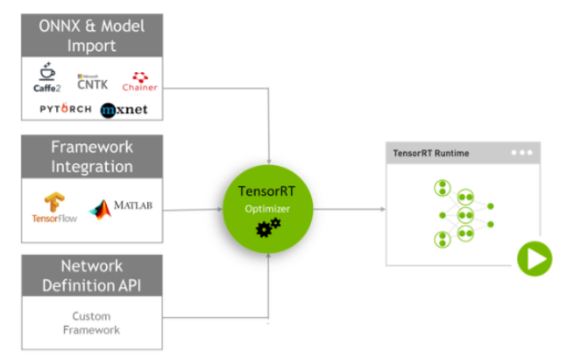
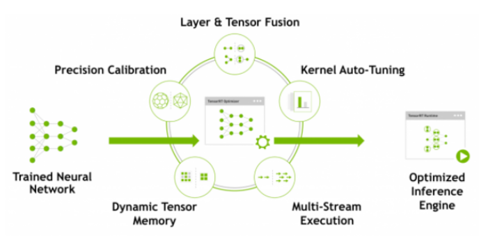

**模型部署流程**

通常，开发和部署一个深度学习模型需要经历三个阶段

- 训练
- 模型部署方案
- 实际部署

1、训练阶段

训练过程中主要是神经网络架构搭建，数据整理，保存模型，验证精度

在训练阶段，TensorRT一般不参与

2、开发部署方案

在此阶段中，可以理解为一个推理系统的方案设计。例如

- 系统中有几个CNN模型需要运行？ 算法部署的硬件平台是CPU还是GPU，是单GPU还是多GPU？
- 数据如何进入到模型？data pipeline怎么设计，数据是来自于相机还是文件？ 来自相机的数据是否需要解码？
- 数据送入到模型之前是否需要预处理？例如均值归一化
- 算法的时延(latency)和吞吐量(throughout)预期是多少
- 是否需要设计多batch输入
- 模型输出推理结果之后，是否需要做后处理

3、实际部署

使用TensorRT在保存的模型文件基础上构建一个推理引擎(inference engine)，保存的模型可能是在不同的深度学习框架下训练的，例如caffe，tensorflow，pytorch。TensorRT中有三个模型解析器，分别是Caffe parser用来解析caffe模型，ONNX parser用来解析ONNX模型，UFF parser用来解析tensorflow模型

在模型解析完成之后，需要指定优化选项，例如推理精度，FP32，FP16或者INT8，然后BtachSize大小等等

如果选择FP16或者FP32，推理精度和训练模型精度几乎一致，然是如果选择INT8，推理精度可能会比训练模型精度要稍微低一些

最后将推理引擎(inference engine)使用序列化之后的格式保存到本地，以便下次直接使用， 这个文件也叫作 plan file。在做工程项目中实际运行的时候，会先读取本地的plan file，然后进行反序列化操作，生成inference engine，然后根据输入计算得到输出。

**TensorRT如何工作的？**

简而言之，TensorRT就是减少模型的inference时间而不降低太多精度

在一般的应用中，plane file只在最初生成一次，以后所有的推理，全部直接加载第一次生成的plan file。plan file文件不具有跨平台和跨版本的特性，所以针对某一硬件，某个版本的tensorRT，其plan file是唯一的。在一个平台上生成的plan file文件是不能直接拷贝到另一平台上使用的，除非两个硬件平台和TensorRT版本完全一致。

plan file我一般保存到本地，后缀为.engine，也有人喜欢以.trt命名，这个文件指的就是plan file。

构建plan file的过程是比较长的，在这段时间中主要完成了以下几件事情

- 消除掉一些没用的输出层
- 消除掉一些对输出没有任何作用的op
- 对conv，bn，ReLU等操作进行融合
- 将相同的参数和tensor的操作进行汇总
- 合并串联某些特殊层

**TensorRT提供那些功能**

TensorRT提供两种部署网络模型的方法

- 直接通过parser解析Caffe，UFF，ONNX模型
- 通过API直接设置每一个layer的权重和参数

TensorRT核心库的关键接口

- Network Definition
- Builder
- Engine
- Caffe Parser
- UFF Parser
- ONNX Parser

**DLA**

DLA(NVIDIA Deep Learning Accelerator)

DLA是一种硬件加速单元，和GPU类似

DLA的定位是加速深度学习中常用计算，加速效果明显，功耗非常低。包括以下几个部件

- convolution core    

  硬件支持Winograd，优化高性能卷积计算，卷积和反卷积

- Single Data Point Processor

  使用Scale和bias做线性计算，用来加速激活函数

- Planar Data Processor

  主要加速Pooling计算

- Cross-channel Data Process

  优化LRN、BN之类的归一化操作

- Data Reshape Engine

  做类似reshape的操作，spliting，slicing，merging等

- Bridge DMA

  专门做内存拷贝

在部署CNN网络模型的时候，常用计算可以交给DLA，其余复杂的计算交给GPU，DLA功耗非常低，由于是硬件专用加速，所以加速效果非常明显。

通过使用TensorRT的混合精度做推理，可以将多种硬件资源的算力组合起来

**trtexec**

在没有写应用程序之前快速地使用tensorRT验证模型性能的一个工具