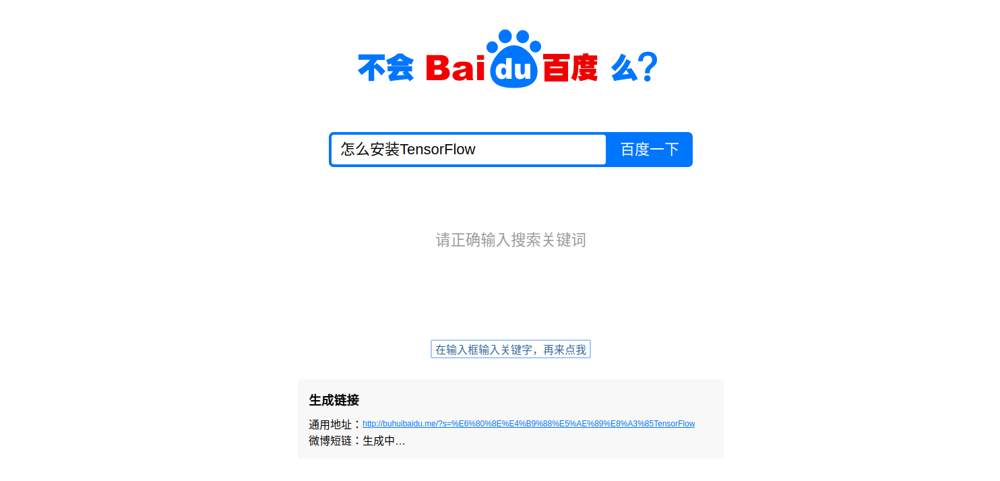
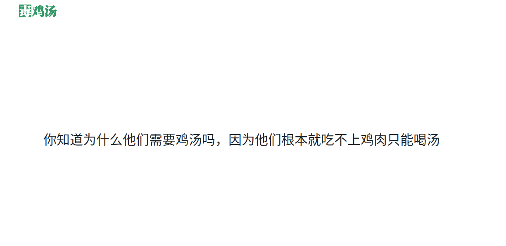

摸鱼摸累了，看几个有趣的网站

平时会收藏一些比较有趣的东西，有的是实用工具类的，有的是沙雕逗B类的

反正现在也是看着LOSS曲线发呆，所以就把自己收藏的一些网站晒一晒

一、工具类

[Codeimg](https://codeimg.io/?ref=Appinn)

可以将自己写的代码片段以图片的形式分享出去，例如推特，朋友圈

[codelf](https://unbug.github.io/codelf/)

写代码的你有没有遇到过变量命名的问题，某个名词表示想半天都记不起来其英文单词，然后就直接用拼音表示了，同事review你的代码的时候，握草，怎么这么low

这个网站就是解决这个痛点，输入中文名词，自动在github上检索出大家常用的名词表示

[极简简历](https://www.polebrief.com/index)

非常适合没有现成模板，想要快速做一版简历的同学，提供快速排版，一键导出功能

[小论文生成器](https://essay.1ts.fun/)

输入论文题目和关键词，生成小论文。相当于手动从网上收集资料改写

[在线图片处理](https://photo.opencool.cn/)

使用CNN来做的图像处理，功能很完善，例如图像无损放大，黑白图像修复，人物动漫化等

[send-anywhere]([https://send-anywhere.com](https://send-anywhere.com/))

这是一个可以在线分享文件的网站，特别适合手头上没有沟通工具发送文件的情况。例如你在linux下写代码，然后你需要发送一个文件给别人，电脑上没有QQ，没有微信，也没有钉钉，又懒得登录邮箱。那么这个一键分享文件的网站就派上用场了

二、沙雕玩意儿

[PornHub Logo](https://logoly.pro/)

PornHub风格Logo生成器，自己想怎么改怎么改，一看就有那味了～

[不会百度吗](http://buhuibaidu.me//)

假如有人问你一个比较弱智的问题，你又不想去回答，那就直接甩给他一个链接，自己去瞧

[毒鸡汤](https://8zt.cc/)

每天一晚毒鸡汤，养颜又健康

