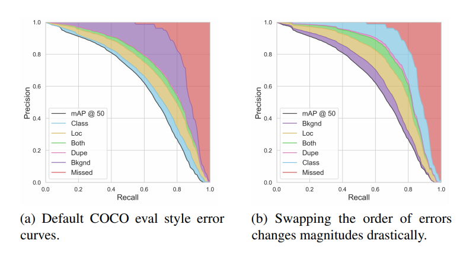
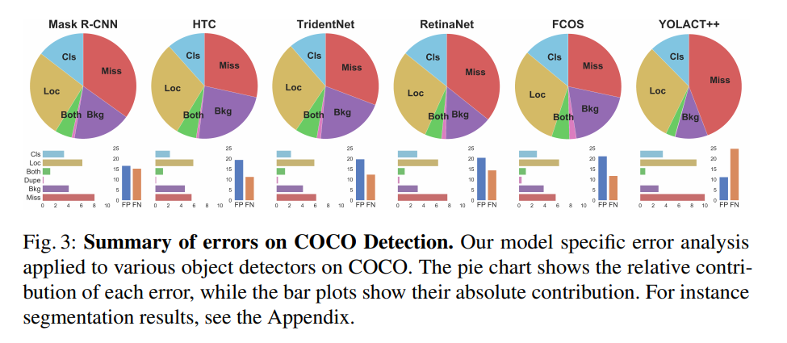
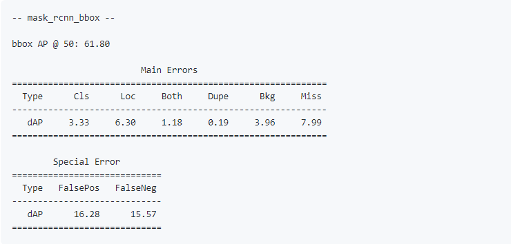
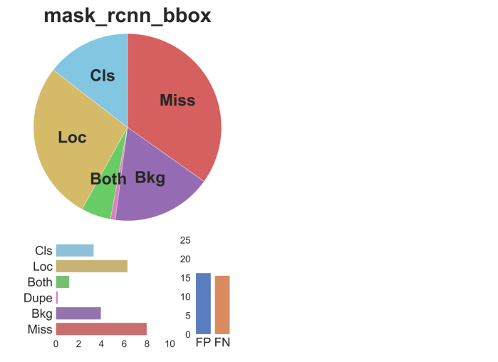

### 一个目标检测器性能评估工具

目标检测和实例分割已经是计算机视觉中一个基础应用了，随着深度学习的发展，目标检测领域也是取得显著的进步。通常，衡量一个目标检测或者分割算法的精度那就是一个指标：mAP

#### mAP

首先计算`Precision`和`Recall`

对于不同的IoU，`IoU > {0,0.1,0.2...0.9,1.0}`，分别计算`True/False Positive/Negtive`

`Precision = True Positive/(True Positive + False Positive)`

`Recall = True Positive/(True Positive + False Negtive)` 

对于不同IoU阈值的时候

`True Positive = IoU大于阈值的时候检测出来的目标数量`


mAP指标存在许多的缺点，其中很重要的一点就是它的复杂性。它被定义为不同目标PR曲线与坐标轴包围的面积的平均值，通过IoU阈值来判断是否分类成功。不同的IoU阈值得到的指标又是不同的，所以coco又提出一种新的方法，mAP0.5：0.95。这样通过分别计算不同阈值下的mAP，再做平均，看起来就更科学一些了。

[目标检测中的mAP含义](https://www.zhihu.com/question/53405779/answer/419532990)


尽管这种计算方法可以反映出检测器的性能，但是当我们要去分析误检情况的时候，mAP就给不了任何参考信息了。mAP很简洁地概括了一个模型的性能，但是很难将误检的情况与mAP分开，误检可能是重复检测，错误分类，错误定位等，所以仅凭mAP是很难诊断检测器性能的

[知乎上讨论mAP是否科学的一个问题](https://www.zhihu.com/question/337856533/answer/805122425)

另外，mAP只能说通过一个通用的指标来衡量检测器性能好坏，但是在不同的应用领域，其好坏不能一概而论。例如，目标检测在医学领域中的应用，医生更倾向于检测结果分类的准确性，bbox稍微偏一些没关系；在机器人或自动驾驶领域，更加倾向于bbox位置要准，以便于位置信号处理，例如机器手的抓取。


#### TIDE

[TIDE](https://dbolya.github.io/tide/paper.pdf),这篇文章中总结了，一个完整的目标检测性能评估工具包应该包括以下几个方面

- 精简总结错误类型，以便一眼就能进行比较
- 每一种错误类型应该被完全隔离，不具有耦合性
- 不依赖于数据集格式，可以跨数据集比较
- 可以根据需要进行更精细的分析，从而隔离错误原因分析

TIDE其实就是一个工具包，目前已经开源，[github链接](https://github.com/dbolya/tide)

此工具包将误检情况分为了几个类别，Classification Error，Localization Error，Both Cls and Loc Error，Duplicate Detection Error，Background Error，Missed GT Error



针对不同的算法，可以输出详细的对比数据图标



#### 安装

```
pip install tidecv
```

#### 使用

```python
from tidecv import TIDE, datasets

tide = TIDE()
tide.evaluate(datasets.COCO(), datasets.COCOResult('path/to/your/results/file'), mode=TIDE.BOX)
tide.summarize() 
tide.plot() 
```

运行之后，就会在终端打印出信息和绘制出图表





TIDE目前支持的数据集格式有COCO，LVIS，PascalVOC，Cityscapes

后面会提供处理自定义数据集格式的api