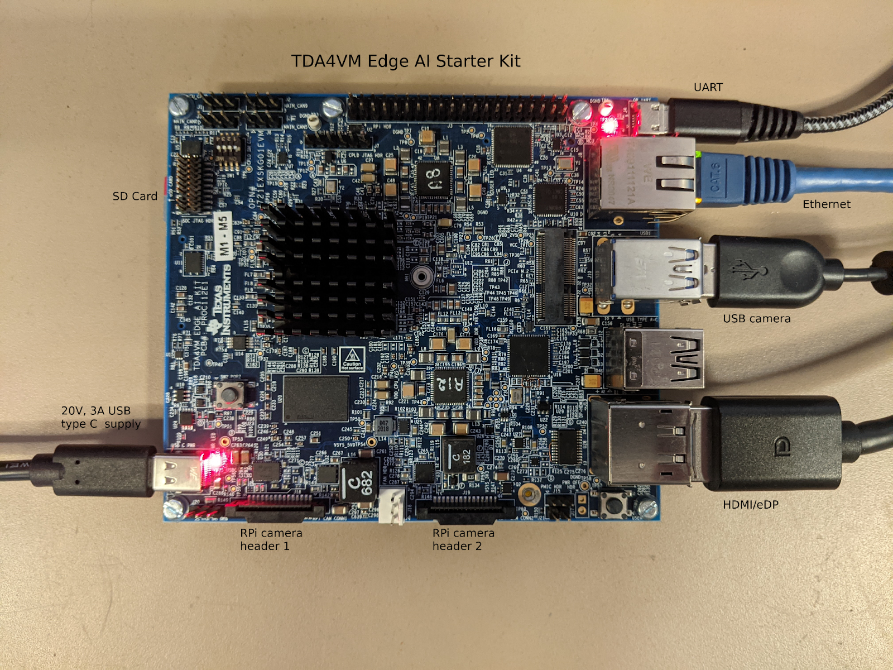
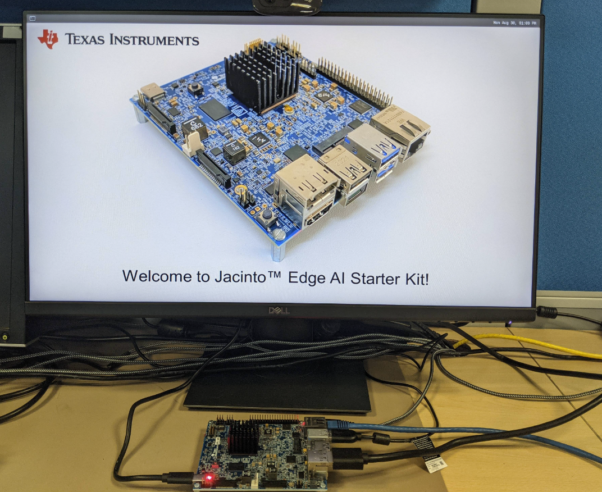
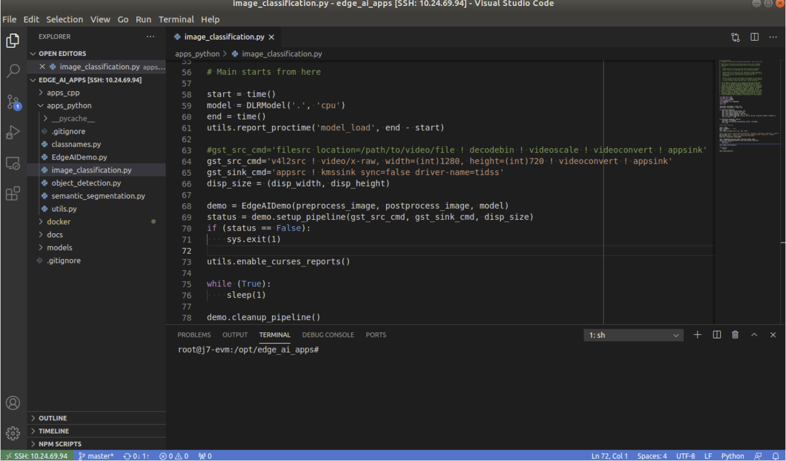

### Preface

TI 的 TDA4VM SoC 包含双核 A72、高性能视觉加速器、视频编解码器加速器、最新的 C71x 和 C66x DSP、用于捕获和显示的高带宽实时 IP、GPU、专用安全岛和安全加速器。 SoC 经过功率优化，可为机器人、工业和汽车应用中的感知、传感器融合、定位和路径规划任务提供一流的性能。TDA4VM Edge AI Starter Kit (SK) 是一款低成本、小尺寸板，功耗大约20W，能提供8TOPS深度学习算力，支持Tensorflow Lite,ONNX,TVM,GStreamer接口



### TDA4VM SK

**运行前准备**

- SK板

- USB camera

- 支持HDMI或者DP口的显示器

- 至少16GB空间SD卡，如果大于16G，需要手动拓展 root filesystem

  

- 网线和局域网

- 串口电源（5-20V DC），功率保证20W以上

  如果功率不够，运行期间可能导致重启

**设置启动模式**

将拨码开关拨到如图所示位置，系统从SD卡启动


#### 支持的相机输入

**USB Camera**

驱动已经在SDK中解决了，根据文档说明，已经测试过C270/C920/C922三款camera，如果遇到camera打不开的情况[参考文档](https://software-dl.ti.com/jacinto7/esd/processor-sdk-linux-sk-tda4vm/latest/exports/docs/faq.html#pub-edgeai-multiple-usb-cams)

**YUV sensor**

支持OV5640，200万像素，CSI接口，YUYV输出，[产品信息](https://www.leopardimaging.com/product/cmos-sensor-modules/mipi-camera-modules/li-am65x-csi2)默认在SDK中，OV5640是被屏蔽的，需要手动开启支持打开`/run/media/mmcblk0p1/uenv.txt`

然后编辑

```
name_overlays=k3-j721e-edgeai-apps.dtbo k3-j721e-sk-csi2-ov5640.dtbo
```

重启设备即可

**Raw sensor**

RPiV2

#### 软件设置

下载[SDK包](https://dr-download.ti.com/software-development/software-development-kit-sdk/MD-4K6R4tqhZI/08.02.00.02/ti-processor-sdk-linux-sk-tda4vm-etcher-image.zip)

下载[烧录软件](https://github.com/balena-io/etcher/releases/tag/v1.7.0)

烧录软件使用1.7.0版本烧录完成即可上电启动

先插入SD卡，然后再上电，显示器就会有如下图所示画面，代表启动成功



板子默认在串口打印日志，所以初次上电需要连接串口，登陆账号

**串口使用**

在host ubuntu上推荐安装minicom，[minicom使用方法参考](https://help.ubuntu.com/community/Minicom)

在windows上推荐安装[teraterm](https://learn.sparkfun.com/tutorials/terminal-basics/tera-term-windows)

ubuntu下启动minicom

```shell
sudo minicom -D /dev/ttyUSB2 -c on
```

板子默认串口波特率是115200
连接串口登陆用户名是root，不需要密码进去之后，ifconfig查询板子ip地址，后面即可使用ssh登陆

推荐使用vscode，可以利用remote插件来直接ssh登陆到板子，然后可以很方便地修改配置文件



**配置软件环境**

软件环境配置才是重点，例如安装tensorflow，onnx，python和c++依赖库

```shell
/opt/edge_ai_apps#./setup_script.sh
```

运行上面脚本，所有环境自动安装

- clone Tensoflow
- clone ONNX-RT
- clone edgeai-tiovx-modules
- clone edgai-gst-plugins
- clone adgeai-tidl-tools
- compile C++ apps

经常会遇到运行失败，原因就是访问github比较慢，多试几次就好

如果需要调试相关环境，直接在运行的时候，加入参数，即可编译debug版本

```shell
root@j7-evm:/opt/edge_ai_apps#./setup_script.sh -d
```


