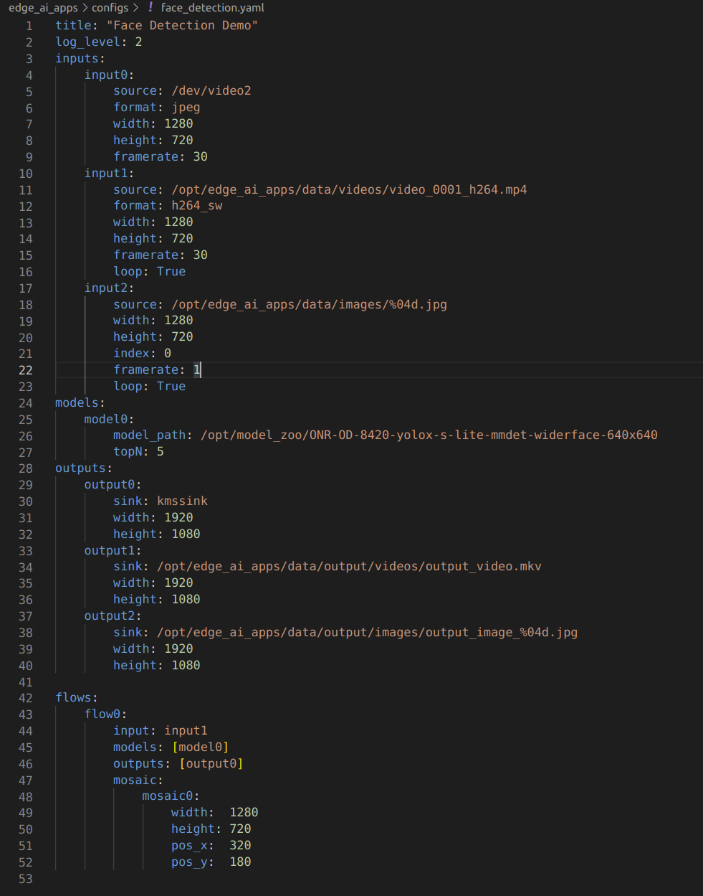

### 运行板载demo

Ti在板载端提供了非常丰富的demo，每个demo都提供了输入文件，模型文件。只需要修改config文件运行即可，demo分为python版本和c++版本，C++版本的运行效率会稍微高一些

#### 配置文件

配置文件通过使用YAML格式来设置参数，配置文件路径为`edge_ai_app/configs`

在配置文件中指定了demo运行的输入类型，例如picture, video, camera

还可以指定加载模型的路径，指定输出类型，例如是保存到本地文件还是输出到显示器

如下图所示



config 文件分为四个部分

- Inputs
- Models
- Outputs
- Flows

##### **Inputs**

```yaml
inputs:
    input0:                                         #Camera Input
        source: /dev/video2                         #Device file entry of the camera
        format: jpeg                                #Input data format suported by camera
        width: 1280                                 #Width and Height of the input
        height: 720
        framerate: 30                               #Framerate of the source

    input1:                                         #Video Input
        source: ../data/videos/video_0000_h264.mp4  #Video file
        format: h264                                #File encoding format
        width: 1280
        height: 720
        framerate: 25

    input2:                                         #Image Input
        source: ../data/images/%04d.jpg             #Sequence of Image files, printf style formatting is used
        width: 1280
        height: 720
        index: 0                                    #Starting Index (optional)
```

**1, Camera**

挂载到板子上的camera会被v4l2src GStreamer来作解析，是否会被识别为camera，需要使用脚本来验证

```shell
./init_script.sh
```

如果插上的camera能够成功被识别，那么会有如下输出

```shell
root@j7-evm:/opt/edge_ai_apps# ./init_script.sh
USB Camera detected
    device = /dev/video2
    format = jpeg
```

**2, Video**

支持H264和H265格式

```yaml
input1:
    source: ../data/videos/video_0000_h264.mp4
    format: h264
    width: 1280
    height: 720
    framerate: 25

input2:
    source: ../data/videos/video_0000_h265.mp4
    format: h265
    width: 1280
    height: 720
    framerate: 25
```

如果不确定某个视频文件具体的视频流格式，那么可以在`format`设置为`auto`, 可以被Gstreamer自动解码识别

**3, Images**

可以配置输入为多张图片，指定图片文件夹路径即可

```yaml
input2:
    source: ../data/images/%04d.jpg
    width: 1280
    height: 720
    index: 0
    framerate: 1
```

**4, RTSP stream**

GStreamer可以解析来自于RTSP数据源非加密数据

```yaml
input0:
    source: rtsp://172.24.145.220:8554/test # rtsp stream url, replace this with correct url
    width: 1280
    height: 720
    framerate: 30
```

##### **Models**

配置推理模型的相关参数，包括模型路径，和模型参数，例如阈值。在anchor based的目标检测算法中可能有`topN`参数，在`segmentation`中有`alpha`参数, 不同类型的模型需要的配置参数不同

```yaml
models:
    model0:
        model_path: ../models/segmentation/ONR-SS-871-deeplabv3lite-mobv2-cocoseg21-512x512   #Model Directory
        alpha: 0.4                                                                            #alpha for blending segmentation mask (optional)
    model1:
        model_path: ../models/detection/TFL-OD-202-ssdLite-mobDet-DSP-coco-320x320
        viz_threshold: 0.3                                                                    #Visualization threshold for adding bounding boxes (optional)
    model2:
        model_path: ../models/classification/TVM-CL-338-mobileNetV2-qat
        topN: 5                                                                               #Number of top N classes (optional)
```

##### **Outputs**

可以配置为显示器输出，保存为视频文件，输出为图片

```yaml
outputs:
    output0:                                                     #Display Output
        sink: kmssink
        width: 1920                                              #Width and Height of the output
        height: 1080
        connector: 39                                            #Connector ID for kmssink (optional)

    output1:                                                     #Video Output
        sink: ../data/output/videos/output_video.mkv             #Output video file
        width: 1920
        height: 1080

    output2:                                                     #Image Output
        sink: ../data/output/images/output_image_%04d.jpg        #Image file name, printf style formatting is used
        width: 1920
        height: 1080
```

**1, 显示器输出**

支持DP和HDMI的输出，确认显示器是否成功连接

```shell
root@j7-evm:/opt/edge_ai_apps# modetest -M tidss -c | grep connected
39      38      connected       DP-1            530x300         12      38
48      0       disconnected    HDMI-A-1        0x0             0       47
```

例如上面显示，connector 39是`connected`状态，所以在配置Output的时候，可以在`connector`填入39

**2，保存本地视频**

```yaml
output1:
    sink: ../data/output/videos/output_video.mkv
    width: 1920
    height: 1080
```

**3，保存为图片**

```yaml
output2:
    sink: ../data/output/images/output_image_%04d.jpg
    width: 1920
    height: 1080
```

##### **Flows**

通过配置Flows可以将不同的`input`,`model`,`output`组合到一起