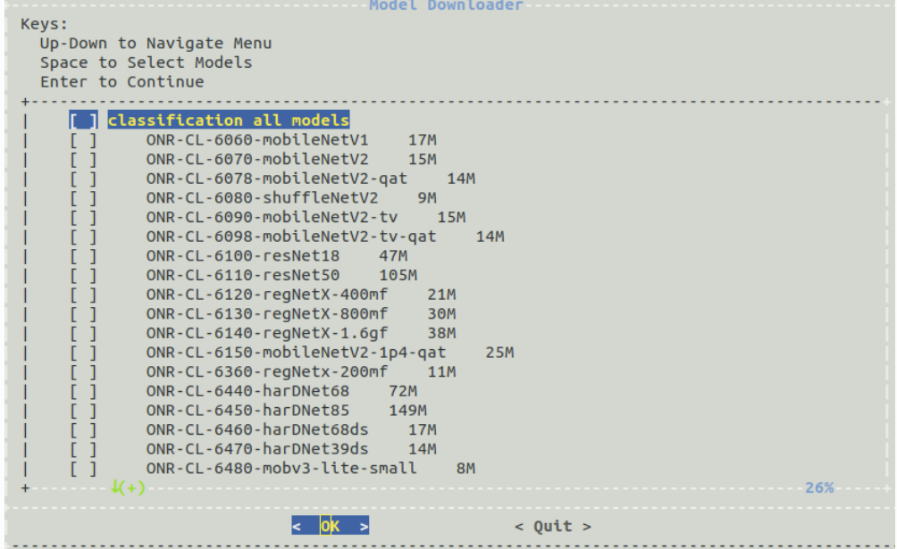

### Running advanced demos

#### 模型下载

跑完板载的简单demo，可以配置比较复杂的任务了

Ti提供了一个叫做[Model Downloader Tool](https://github.com/TexasInstruments/edgeai-modelzoo)的工具，用来下载不同类型的预训练模型

运行下载器

```shell
root@j7-evm:/opt/edge_ai_apps# ./download_models.sh
```

是一个可交互界面，可以通过键盘选择想要下载的模型文件，其保存路径在`/opt/model/zoo`



#### 自定义模型

官方提供的模型肯定是不能满足个人业务需求的，所以自己训练模型并倒入到tda4运行，是一个必然绕不开的路

Ti SDK提供了加载自定义模型的接口

- Tensorflow Lite
- ONNX
- TVM/Neo AI-DLR

每一个DNN模型需要满足以下结构

```
TFL-OD-2010-ssd-mobV2-coco-mlperf-300x300
│
├── param.yaml
│
├── artifacts
│   ├── 264_tidl_io_1.bin
│   ├── 264_tidl_net.bin
│   ├── 264_tidl_net.bin.layer_info.txt
│   ├── 264_tidl_net.bin_netLog.txt
│   ├── 264_tidl_net.bin.svg
│   ├── allowedNode.txt
│   └── runtimes_visualization.svg
│
└── model
    └── ssd_mobilenet_v2_300_float.tflite
```

- model

  模型文件，例如tflite，onnx等

- artifacts

  由SDK编译生成出来的文件，网络层信息，量化信息，节点名称。

  此部分是将模型转为TiDL模型中最为关键的一部分，Ti提供专门的[文档](https://software-dl.ti.com/jacinto7/esd/processor-sdk-linux-sk-tda4vm/latest/exports/docs/inference_models.html#pub-edgeai-compile-artifacts)来解释这部分内容。

- param.yaml

  定义前处理，后处理等参数，例如anchor based和anchor free的后处理操作就很大不一样, 例如目标检测和语义分割对应的param格式就不一样，Ti提供了[benchmark](https://github.com/TexasInstruments/edgeai-benchmark/tree/master/examples/configs/yaml), 可以在里面找到对应的模板

SDK提供了一个工具叫做[Edge AI TIDL Tools](https://github.com/TexasInstruments/edgeai-tidl-tools/blob/master/examples/osrt_python/README.md#model-compilation-on-pc), 可以将通用模型转为Ti支持的DNN模型，目前支持三种模型的转换，但是**Ti建议分别使用三种模型尝试转换，哪种模型的精度高就选用哪种模型做最终部署**

