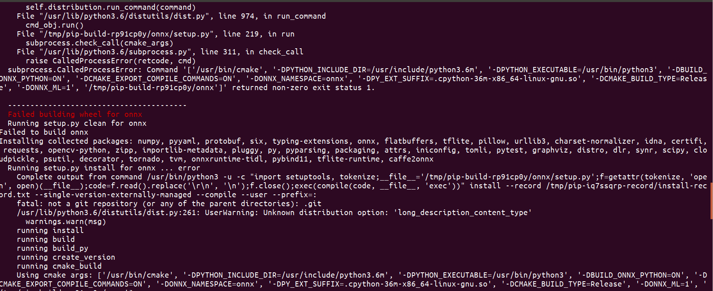
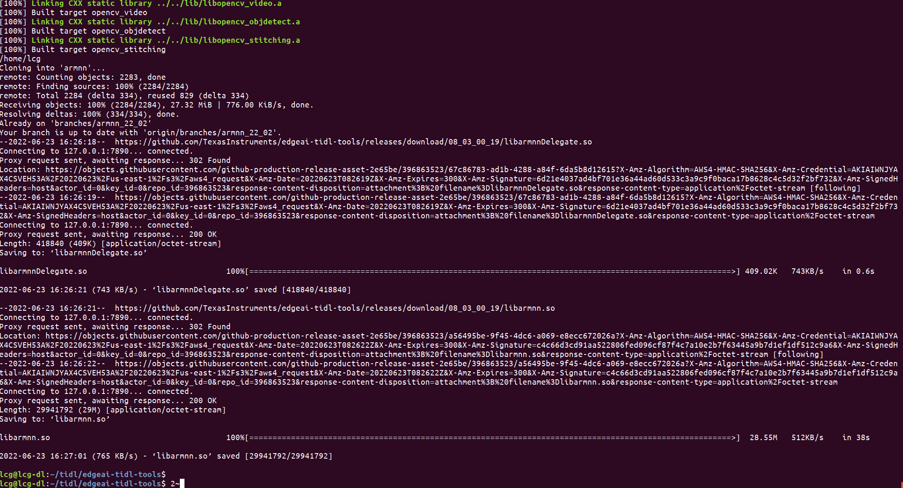
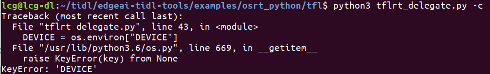
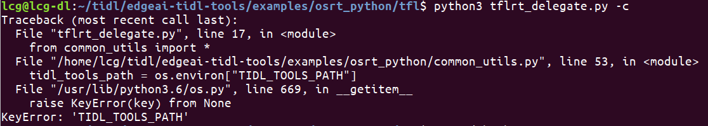
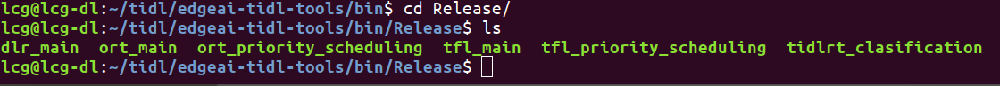

### TiDL-tools

在TDA4上进行inference的时候，主要是跑在A72和C71-MMA异构系统上，并不是单核完成。具体那些操作在A

核哪些操作在DSP核，需要在SDK编译时候配置。

[TF-Lite](https://www.tensorflow.org/lite/guide/inference)提供了[TFLite Delgate API](https://www.tensorflow.org/lite/performance/delegates), TiDL可以很方便地去调用。ONNX和TVM则是调用标准API


#### WorkFlow

以TFLite为例，TFLite的模型首先需要在PC上根据SDK生成Artifacts，然后再将模型和artifact一起作为输入，送到soc中完成推理任务


### 模型转换

#### 1，在PC上[搭建环境](https://github.com/TexasInstruments/edgeai-tidl-tools/blob/master/README.md#setup)

建议Ubuntu18.04 + Python3.6， 模型转换只能通过python脚本完成

需要使用pip配置环境，需要先安装pip

```shell
sudo apt install python3-pip
```

下载代码，然后安装

```shell
git clone https://github.com/TexasInstruments/edgeai-tidl-tools.git
export DEVICE=j7
#export DEVICE=am62   #设置DEVICE
cd edgeai-tidl-tools
source ./setup.sh
```

需要大量下载，时间会比较长

可能会在某个步骤安装出错，需要打开setup.sh，按照终端输出信息来重试几次。

**编译ONNX失败**



这是因为没有安装proto compillar

```shell
sudo apt install protobuf-compiler libprotoc-dev
```

成功安装如图所示



**配置环境变量**

在代码里面有大量使用系统环境变量的地方，需要事先将环境变量设置好





```shell
export DEVICE=j7
export TIDL_TOOLS_PATH="/home/lcg/tidl/edgeai-tidl-tools"
```

临时修改环境比那两只需要在shell中直接执行export即可，如果需要一劳永逸，添加到`~/.bahsrc`中即可

#### 2，**验证环境是否可用**

```shell
./scripts/run_python_examples.sh
```

脚本中包含了很多验证的过程，如果哪一步骤出错，可以单独验证

如果出现这种情况

```shell
ValueError: could not load library libvx_tidl_rt.so
```

或者下面这种情况


需要在当前shell终端重新运行`source ./setup.sh `，配置当前终端环境

```shell
/home/lcg/tidl/edgeai-tidl-tools/tidl_tools/tidl_graphVisualiser.out: error while loading shared libraries: libcgraph.so.6: cannot open shared object file: No such file or directory
```


没有找到`libcgraph.so`库，如果安装过，则把路径添加到`$ld_LIBRARY_PATH`即可

如果没有安装过，则`sudo apt install graphviz`

**使用python脚本验证example**

python脚本可以同时完成模型转换和推理验证

使用如下命令生成artifacts，并生成结果图片

```SHELL
cd examples/osrt_python/tfl
python3 tflrt_delegate.py -c
#具体 -c -d 参数可以参考代码
```


如果能生成以上结果，就说明python运行example没有问题

**使用C++验证example**

C++的example只能完成推理验证，不能做模型转换。所以需要使用python代码生成的artifacts来做推理生成结果

C++的API需要读取`yaml`文件，所以需要单独安装一个库

```shell
sudo apt install libyaml-cpp-dev
```

在`edgaai-tidl-tools`目录下创建`build`文件夹用来生成编译文件

```shell
mkdir build && cd build
```

在编译过程中，通过cmake设置参数来指定编译类型

```shell
cmake-gui ../example
```

- TENSORFLOW_INSTALL_DIR : defaults check at ~/tensorflow
- ONNXRT_INSTALL_DIR: defaults check at ~/onnxruntime
- DLR_INSTALL_DIR: defaults check at ~/neo-ai-dlr
- OPENCV_INSTALL_DIR: defaults check at ~/opencv-4.1.0
- ARMNN_PATH: defaults check at ~/armnn
- TARGET_FS_PATH: defaults check ~/targetfs
- CROSS_COMPILER_PATH: defaults check ~/gcc-arm-9.2-2019.12-x86_64-aarch64-none-linux-gnu

这里采用默认配置即可

```shell
#例如你要修改opencv路径
#cmake -DOPENCV_INSTALL_DIR="/home/opencv4.1" -DTARGET_CPU=arm ../examples
make -j
cd ../
```

在repo的根目录生成bin文件夹



运行example

```shell
# -f 指定artifacts，由python脚本生成
# -i 指定输入图像
./bin/Release/ort_main -f model-artifacts/od-ort-ssd-lite_mobilenetv2_fpn -i test_data/ADE_val_00001801.jpg
```


#### 3，SOC端推理

在模型转化阶段生成的`artifacts`，此处就派上用场了

将文件夹拷贝到soc板，`./model-artifacts`,`models`

这里的脚本只能验证流程是否跑通，并不能得到具体的精度数据，如果需要量化评估，需要参考ti 提供的[benchmark](https://github.com/TexasInstruments/edgeai-benchmark)


