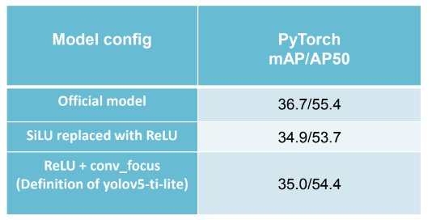

#### YOLOX模型在TiDL上的部署

- **pt模型转onnx**
- **onnx使用TiDL-tools工具加载**
- **生成artifacts**
- **拷贝artifacts到SK板**
- **在SK板上写demo，输入，输出**


#### Pytorch转ONNX

官方YOLOX的模型结构中有些不适合嵌入式端的部署，所以Ti在官方yolox的repo下重新fork了一个，叫做[edgeai_yolox](https://github.com/TexasInstruments/edgeai-yolox)

官方YOLOX网络结构前面有Focus层，其中的slice操作在嵌入式端是不被支持的。ti称之为**not embedded friendly**，然后使用一个比较轻量的巻积操作取而代之


SiLU操作在嵌入式端也没有很好的支持，对于量化操作也不友好，所以使用ReLU代替SiLU，精度降低2%



SPP模块也被相应的maxpool操作代替


验证完ONNX的准确性之后即可开始下一步操作

```shell
python export.py --weights pretrained_models/yolov5s6_640_ti_lite/weights/best.pt --img 640 --batch 1 --simplify --export-nms --opset 11 # export at 640x640 with batch size 1
```


#### TiDL-tools加载ONNX模型

**Model Compilation**

在编译模型之前，需要准备两个模型文件，onnx文件和prototxt文件

prototxt文件是用来描述detection layer的相关信息的，区别caffe的prototxt


|      | http://software-dl.ti.com/jacinto7/esd/modelzoo/latest/models/vision/detection/coco/edgeai-yolox/yolox_nano_ti_lite_metaarch.prototxt |
| ---- | ------------------------------------------------------------ |
|      |                                                              |


```
export LD_LIBRARY_PATH="/home/lcg/tidl/edgeai-tidl-tools/tidl_tools:$LD_LIBRARY_PATH"
```

