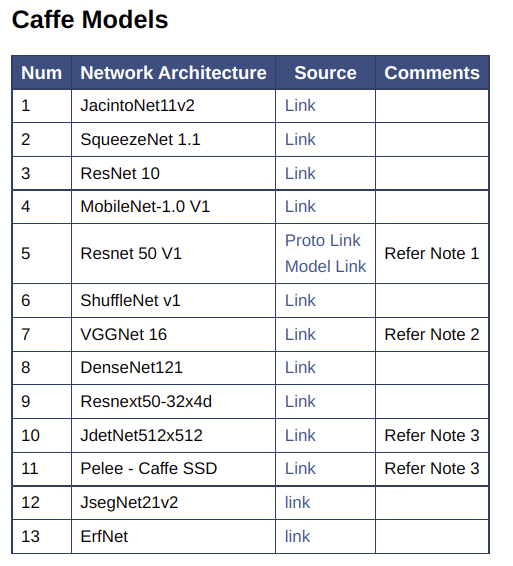
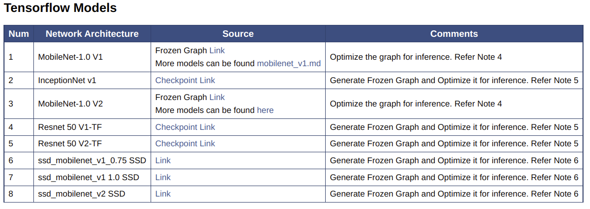
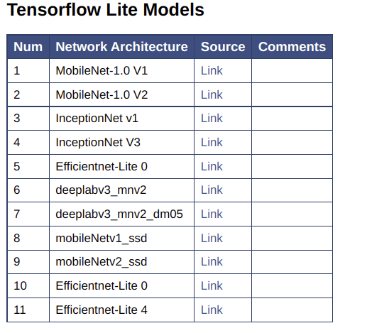
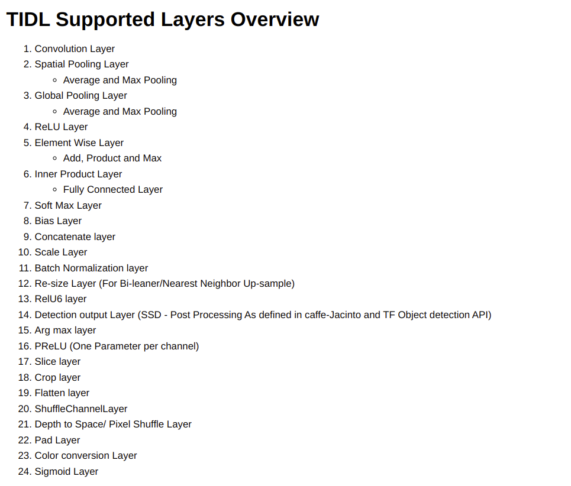

## TiDL在SDK7.3上使用

SDK7.3是SDK7最后一个大版本，Ti建议直接使用SDK8及以上。

---

**支持模型框架**

- caffe model（.caffemodel &.prototxt）
- tensorflow （.pb or .tflite）
- ONNX（.onnx）

和SDK8略有不同，SDK8貌似不再支持caffe，新增了TVM的支持

**支持模型列表**

*from [link](file:///home/lcg/Downloads/ti-processor-sdk-rtos-j721e-evm-07_03_00_07-docs_only/tidl_j7_02_00_00_07/ti_dl/docs/user_guide_html/md_tidl_models_info.html)*

 




 

**支持算子**

*from [link](file:///home/lcg/Downloads/ti-processor-sdk-rtos-j721e-evm-07_03_00_07-docs_only/tidl_j7_02_00_00_07/ti_dl/docs/user_guide_html/md_tidl_layers_info.html)*




目标分解

YOLOX运行在TDA4-EVM based on SDK7.3

- 移植TiDL-Tools
  - 编译tidl-tools，加到libs
  
    - 编译PDK
  
      将编译完成之后`ti-processor-sdk-rtos-j721e-evm-07_03_00_07/pdk_jacinto_07_03_00_29/packages/ti/board/lib/j721e_evm/r5f/release`下的产物替换到C盘Ti文件夹下`pdk_02_00_00`中的文件
  
    - 编译SDK
  
  - 
  
- YOLOX转ONNX

- ONNX转TiDL artifacts

- 前处理，后处理


### 配置环境

**1，编译PDK**

在编译TiDL之前需要先配置好PDK环境

```shell
cd PDK_INSTALL_DIR/packages/ti/build
make -s pdk_libs_allcores BOARD=<board>
```


1.环境变量

```shell
export TIDL_INSTALL_PATH=/home/lcg/Downloads/ti-processor-sdk-rtos-j721e-evm-07_03_00_07/tidl_j7_02_00_00_07

sudo apt install graphviz-dev

export TIDL_GRAPHVIZ_PATH=/usr
```


issue

---

1, linux版本和RTOS版本区别？