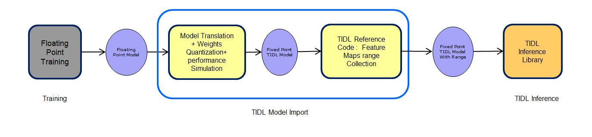
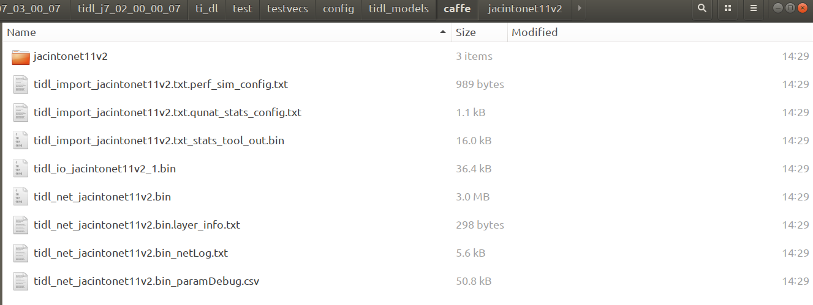
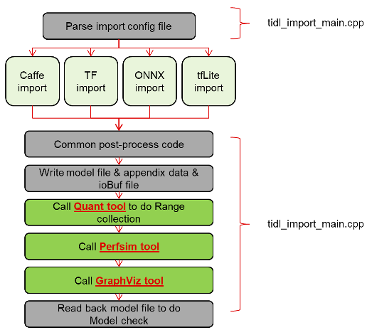

## TiDL在SDK7.3上使用

SDK7.3是SDK7最后一个大版本，Ti建议直接使用SDK8及以上。

---

**支持模型框架**

- caffe model（.caffemodel &.prototxt）
- tensorflow （.pb or .tflite）
- ONNX（.onnx）

和SDK8略有不同，SDK8貌似不再支持caffe，新增了TVM的支持

**支持模型列表**

*from [link](file:///home/lcg/Downloads/ti-processor-sdk-rtos-j721e-evm-07_03_00_07-docs_only/tidl_j7_02_00_00_07/ti_dl/docs/user_guide_html/md_tidl_models_info.html)*

 


 

**支持算子**

*from [link](file:///home/lcg/Downloads/ti-processor-sdk-rtos-j721e-evm-07_03_00_07-docs_only/tidl_j7_02_00_00_07/ti_dl/docs/user_guide_html/md_tidl_layers_info.html)*


### 配置TiDL环境

**1，编译PDK**

在编译TiDL之前需要先配置好PDK环境

```shell
cd PDK_INSTALL_DIR/packages/ti/build
make -s pdk_libs_allcores BOARD=<board>
```

PDK包中是带有预编译文件的，所以可以不编译pdk，直接使用里面二进制文件下一步

**2.编译TiDL**

```shell
export TIDL_INSTALL_PATH=/home/lcg/Downloads/ti-processor-sdk-rtos-j721e-evm-07_03_00_07/tidl_j7_02_00_00_07
sudo apt install graphviz-dev
export TIDL_GRAPHVIZ_PATH=/usr
```

修改`makerules/config.mk`文件

```makefile
PSDK_INSTALL_PATH ?= /home/lcg/Downloads/ti-processor-sdk-rtos-j721e-evm-07_03_00_07
```

安装OpenCV

```shell
wget https://github.com/opencv/opencv/archive/3.1.0.zip
unzip opencv-3.1.0.zip
cmake -DBUILD_opencv_highgui:BOOL="1" -DBUILD_opencv_videoio:BOOL="0" -DWITH_IPP:BOOL="0" -DWITH_WEBP:BOOL="1" -DWITH_OPENEXR:BOOL="1" -DWITH_IPP_A:BOOL="0" -DBUILD_WITH_DYNAMIC_IPP:BOOL="0" -DBUILD_opencv_cudacodec:BOOL="0" -DBUILD_PNG:BOOL="1" -DBUILD_opencv_cudaobjdetect:BOOL="0" -DBUILD_ZLIB:BOOL="1" -DBUILD_TESTS:BOOL="0" -DWITH_CUDA:BOOL="0" -DBUILD_opencv_cudafeatures2d:BOOL="0" -DBUILD_opencv_cudaoptflow:BOOL="0" -DBUILD_opencv_cudawarping:BOOL="0" -DINSTALL_TESTS:BOOL="0" -DBUILD_TIFF:BOOL="1" -DBUILD_JPEG:BOOL="1" -DBUILD_opencv_cudaarithm:BOOL="0" -DBUILD_PERF_TESTS:BOOL="0" -DBUILD_opencv_cudalegacy:BOOL="0" -DBUILD_opencv_cudaimgproc:BOOL="0" -DBUILD_opencv_cudastereo:BOOL="0" -DBUILD_opencv_cudafilters:BOOL="0" -DBUILD_opencv_cudabgsegm:BOOL="0" -DBUILD_SHARED_LIBS:BOOL="0" ../
```

下载安装protobuf

```shell
#一定要下载安装V3.11.3版本
cd ti-processor-sdk-rtos-j721e-evm-07_03_00_07
wget https://github.com/protocolbuffers/protobuf/releases/download/v3.11.3/protobuf-cpp-3.11.3.tar.gz
tar -zxvf protobuf-cpp-3.11.3.tar.gz
cd ptotobuf-3.11.3
./configure CXXFLAGS=-fPIC --enable-shared=no LDFLAGS="-static"
make
```

下载安装FlatBuffer

```shell
cd ti-processor-sdk-rtos-j721e-evm-07_03_00_07
wget https://github.com/google/flatbuffers/archive/v1.12.0.zip
unzip v1.12.0.zip
cd flatbuffers-1.12.0
cmake -G "Unix Makefiles" -DCMAKE_POSITION_INDEPENDENT_CODE=ON 
make
```

编译TiDL

```shell
cd ti-processor-sdk-rtos-j721e-evm-07_03_00_07/tidl_j7_02_00_00_07
make TARGET_PLATFORM=PC
```

如果以下`.out`文件能在对应位置找到，说明编译成功

- tidl_model_import.out in "ti_dl/utils/tidlModelImport/out"
- PC_dsp_test_dl_algo.out in "ti_dl/test"
- ti_cnnperfsim.out in "ti_dl/utils/perfsim"

### TiDL Importer

顾名思义，此工具可以转换caffe,tensorflow,ONNX格式的模型

转换过程如下图所示



Ti的SDK文档真的是写的超级烂，可能是不准备维护SDK7了

转换工具在`ti_dl/utils/tidlModelImport/out`目录下，文档里面写的demo，在代码里面根本找不到对应文件。很多文件只有配置，并没有模型文件。还好提供了一个caffemodel和prototxt可以跑demo

```shell
cd ti-processor-sdk-rtos-j721e-evm-07_03_00_07/tidl_j7_02_00_00_07/ti_dl/utils/tidlModelImport
./out/tidl_model_import.out ../../test/testvecs/config/import/public/caffe/tidl_import_jacintonet11v2.txt
```


这样说明model impoert成功了

生成的文件根据config中配置的路径来生成，在文件夹内可以看到生成的所有信息

````shell
outputNetFile      = "../../test/testvecs/config/tidl_models/caffe/tidl_net_jacintonet11v2.bin"
outputParamsFile   = "../../test/testvecs/config/tidl_models/caffe/tidl_io_jacintonet11v2_"
````



**导入流程**



- 解析config文件
- 计算每层操作计算所需的内存大小，如果相邻层可合并，那就合并减少计算量
- 转换操作算子，将框架层的算子转换为Ti底层支持的算子
- 生成量化配置文件
- 编译配置文件，性能优化
- 将转换完成之后网络结构可视化
- 检查模型是否有误，准备部署

### TiDL Inference

```shell
cd tidl_j7_02_00_00_07/ti_dl/test
./PC_dsp_test_dl_algo.out
```

运行完成之后，会在`test/testvecs/output`下生成bin文件，也就是网络输出层的tensor

是没有经过postprocess处理的网络输出信息

如果需要可视化，那么需要进行postprocess处理

